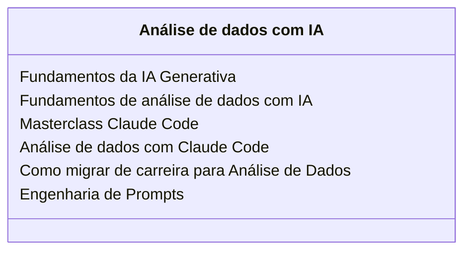
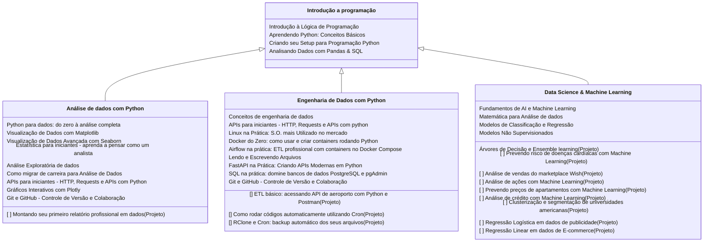
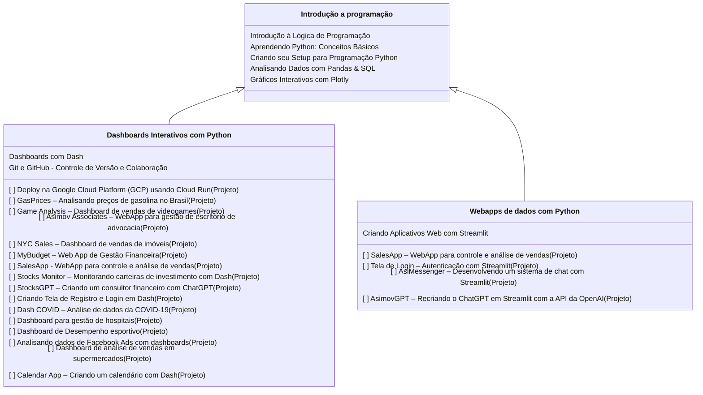
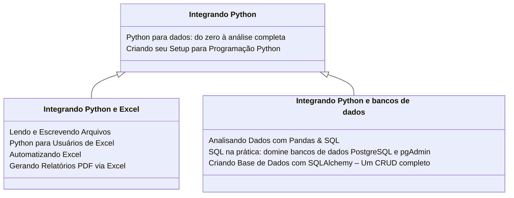

## Domine IA para analisar dados

```mermaid
classDiagram
    
    class Análise de dados com IA["Análise de dados com IA"]{
        Fundamentos da IA Generativa
        Fundamentos de análise de dados com IA
        Masterclass Claude Code
        Análise de dados com Claude Code
        Como migrar de carreira para Análise de Dados
        Engenharia de Prompts
    }    
```

## Torne-se um expert em dados

```mermaid
classDiagram

    introducao <|-- Análise de dados com Python
    introducao <|-- Engenharia de Dados com Python
    introducao <|-- Data Science
    
    class introducao["Introdução a programação"]{    
        Introdução à Lógica de Programação
        Aprendendo Python: Conceitos Básicos
        Criando seu Setup para Programação Python
        Analisando Dados com Pandas & SQL
    } 
    class Análise de dados com Python["Análise de dados com Python"]{
        Python para dados: do zero à análise completa
        Visualização de Dados com Matplotlib
        Visualização de Dados Avançada com Seaborn
        Estatística para iniciantes - aprenda a pensar como um analista
        Análise Exploratória de dados
        Como migrar de carreira para Análise de Dados
        APIs para iniciantes - HTTP, Requests e APIs com Python
        Gráficos Interativos com Plotly
        Git e GitHub - Controle de Versão e Colaboração
        [ ] Montando seu primeiro relatório profissional em dados(Projeto)
    }
    class Engenharia de Dados com Python["Engenharia de Dados com Python"]{
        Conceitos de engenharia de dados        
        APIs para iniciantes - HTTP, Requests e APIs com python
        Linux na Prática: S.O. mais Utilizado no mercado
        Docker do Zero: como usar e criar containers rodando Python
        Airflow na prática: ETL profissional com containers no Docker Compose
        Lendo e Escrevendo Arquivos
        FastAPI na Prática: Criando APIs Modernas em Python
        SQL na prática: domine bancos de dados PostgreSQL e pgAdmin
        Git e GitHub - Controle de Versão e Colaboração
        [] ETL básico: acessando API de aeroporto com Python e Postman(Projeto)
        [] Como rodar códigos automaticamente utilizando Cron(Projeto)
        [] RClone e Cron: backup automático dos seus arquivos(Projeto)
    }
    class Data Science["Data Science & Machine Learning"]{	    
	    Fundamentos de AI e Machine Learning
	    Matemática para Análise de dados
	    Modelos de Classificação e Regressão
	    Modelos Não Supervisionados
	    Árvores de Decisão e Ensemble learning(Projeto)
		[ ] Prevendo risco de doenças cardíacas com Machine Learning(Projeto)
		[ ] Análise de vendas do marketplace Wish(Projeto)
		[ ] Análise de ações com Machine Learning(Projeto)
		[ ] Prevendo preços de apartamentos com Machine Learning(Projeto)
		[ ] Análise de crédito com Machine Learning(Projeto)
		[ ] Clusterização e segmentação de universidades americanas(Projeto)
		[ ] Regressão Logística em dados de publicidade(Projeto)
		[ ] Regressão Linear em dados de E-commerce(Projeto)
    }
```

## Desenvolva uma nova habilidade em dados

```mermaid
classDiagram

    introducao <|-- Dashboards Interativos com Python
    introducao <|-- Webapps de dados com Python
    
    class introducao["Introdução a programação"]{    
        Introdução à Lógica de Programação
        Aprendendo Python: Conceitos Básicos
        Criando seu Setup para Programação Python
        Analisando Dados com Pandas & SQL
		Gráficos Interativos com Plotly
    } 
    class Dashboards Interativos com Python["Dashboards Interativos com Python"]{
		Dashboards com Dash
		Git e GitHub - Controle de Versão e Colaboração
		[ ] Deploy na Google Cloud Platform (GCP) usando Cloud Run(Projeto)
		[ ] GasPrices – Analisando preços de gasolina no Brasil(Projeto)
		[ ] Game Analysis – Dashboard de vendas de videogames(Projeto)
		[ ] Asimov Associates – WebApp para gestão de escritório de advocacia(Projeto)
		[ ] NYC Sales – Dashboard de vendas de imóveis(Projeto)
		[ ] MyBudget – Web App de Gestão Financeira(Projeto)
		[ ] SalesApp - WebApp para controle e análise de vendas(Projeto)
		[ ] Stocks Monitor – Monitorando carteiras de investimento com Dash(Projeto)
		[ ] StocksGPT – Criando um consultor financeiro com ChatGPT(Projeto)
		[ ] Criando Tela de Registro e Login em Dash(Projeto)
		[ ] Dash COVID – Análise de dados da COVID-19(Projeto)
		[ ] Dashboard para gestão de hospitais(Projeto)
		[ ] Dashboard de Desempenho esportivo(Projeto)
		[ ] Analisando dados de Facebook Ads com dashboards(Projeto)
		[ ] Dashboard de análise de vendas em supermercados(Projeto)
		[ ] Calendar App – Criando um calendário com Dash(Projeto)
    }
    class Webapps de dados com Python["Webapps de dados com Python"]{
		Criando Aplicativos Web com Streamlit
		[ ] SalesApp – WebApp para controle e análise de vendas(Projeto)
		[ ] Tela de Login – Autenticação com Streamlit(Projeto)
		[ ] AsiMessenger – Desenvolvendo um sistema de chat com Streamlit(Projeto)
		[ ] AsimovGPT – Recriando o ChatGPT em Streamlit com a API da OpenAI(Projeto)
    }
    
```

## Aprenda a integrar Python com mais ferramentas

```mermaid
classDiagram
    Integrando Python <|-- Integrando Python e Excel
    Integrando Python <|-- Integrando Python e bancos de dados
    class Integrando Python["Integrando Python"]{
		Python para dados: do zero à análise completa
		Criando seu Setup para Programação Python		
    }    
    class Integrando Python e Excel["Integrando Python e Excel"]{
		Lendo e Escrevendo Arquivos
		Python para Usuários de Excel
		Automatizando Excel
		Gerando Relatórios PDF via Excel
    }    
    class Integrando Python e bancos de dados["Integrando Python e bancos de dados"]{
		Analisando Dados com Pandas & SQL
		SQL na prática: domine bancos de dados PostgreSQL e pgAdmin
		Criando Base de Dados com SQLAlchemy – Um CRUD completo
    }    
```

[[Analista de Dados]]
