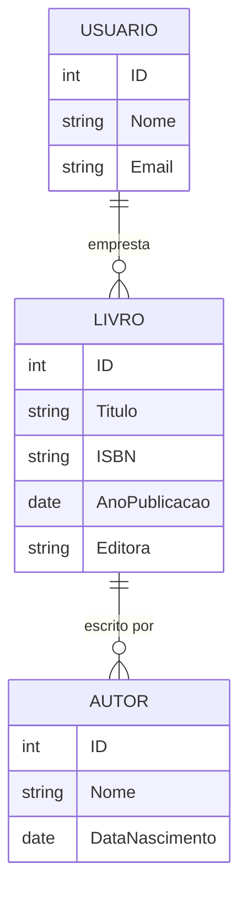
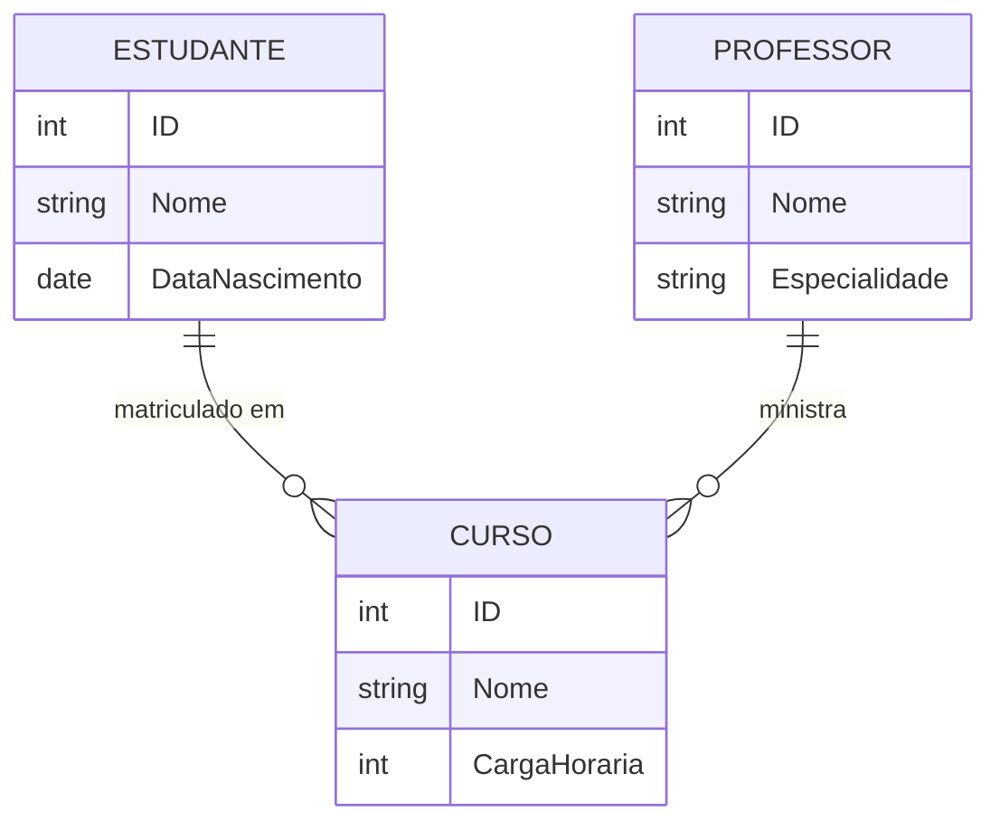

Vamos abordar um tema essencial para o desenvolvimento de sistemas de informação: o **modelo lógico de banco de dados**. Este artigo será dividido em tópicos para facilitar o entendimento, e ao final, veremos exemplos práticos de diagramas de entidade-relacionamento (ER) utilizando o Mermaid, uma ferramenta poderosa para criar diagramas.

## Tópicos do Artigo

1. **Introdução ao Modelo Lógico de Banco de Dados**
2. **Conceitos Fundamentais**
 1. Entidades
 2. Atributos
 3. Relacionamentos
3. **Normalização de Dados**
 1. Primeira Forma Normal (1FN)
 2. Segunda Forma Normal (2FN)
 3. Terceira Forma Normal (3FN)
4. **Diagrama de Entidade-Relacionamento (ER)**
 1. Definição
 2. Componentes de um Diagrama ER
 3. Notação de Chen e Notação de Crow's Foot
5. **Criando Diagramas ER com Mermaid**
 1. Introdução ao Mermaid
 2. Exemplo Prático: Sistema de Biblioteca
 3. Exemplo Prático: Sistema de Gestão Escolar
6. **Conclusão**

### 1. Introdução ao Modelo Lógico de Banco de Dados

O modelo lógico de banco de dados é uma representação abstrata da estrutura de um banco de dados. Ele define como os dados serão armazenados, organizados e manipulados, garantindo a integridade e a eficiência do sistema. Ao contrário do modelo físico, que detalha a implementação concreta no sistema de gerenciamento de banco de dados (SGBD), o modelo lógico foca na estrutura e nas relações entre os dados.

### 2. Conceitos Fundamentais

#### 2.1 Entidades
Entidades são objetos do mundo real que têm existência própria e são armazenados no banco de dados. Por exemplo, em um sistema de biblioteca, as entidades podem ser "Livro", "Autor" e "Usuário".

#### 2.2 Atributos
Atributos são características ou propriedades das entidades. Por exemplo, um "Livro" pode ter atributos como título, ISBN, ano de publicação e editora.

#### 2.3 Relacionamentos
Relacionamentos definem como as entidades estão associadas entre si. Por exemplo, um "Autor" escreve um "Livro", e um "Usuário" pode emprestar um "Livro".

### 3. Normalização de Dados

A normalização é o processo de organizar os dados em um banco de dados para minimizar a redundância e melhorar a integridade dos dados.

#### 3.1 Primeira Forma Normal (1FN)
Remove duplicatas, garantindo que cada coluna contenha apenas valores atômicos.

#### 3.2 Segunda Forma Normal (2FN)
Garante que todos os atributos não chave dependam totalmente da chave primária.

#### 3.3 Terceira Forma Normal (3FN)
Remove dependências transitivas, onde atributos não chave dependem de outros atributos não chave.

### 4. Diagrama de Entidade-Relacionamento (ER)

#### 4.1 Definição
O diagrama ER é uma ferramenta visual para modelar os dados de um sistema, mostrando as entidades, atributos e relacionamentos.

#### 4.2 Componentes de um Diagrama ER
- **Entidades**: Representadas por retângulos.
- **Atributos**: Representados por elipses.
- **Relacionamentos**: Representados por losangos.

#### 4.3 Notação de Chen e Notação de Crow's Foot
- **Notação de Chen**: Utiliza símbolos gráficos detalhados.
- **Notação de Crow's Foot**: Utiliza símbolos mais simples, favorecendo a clareza.

### 5. Criando Diagramas ER com Mermaid

#### 5.1 Introdução ao Mermaid
Mermaid é uma linguagem de marcação para criar diagramas de maneira simples e eficiente. Ele permite a criação de diagramas ER diretamente em código Markdown, o que facilita a integração com outras ferramentas.

#### 5.2 Exemplo Prático: Sistema de Biblioteca

Vamos criar um diagrama ER para um sistema de biblioteca utilizando o Mermaid.

#### 5.3 Exemplo Prático: Sistema de Gestão Escolar

Agora, vamos criar um diagrama ER para um sistema de gestão escolar.

### 6. Conclusão

O modelo lógico de banco de dados é uma etapa crucial no desenvolvimento de sistemas de informação, proporcionando uma visão clara e organizada da estrutura dos dados. Utilizando diagramas ER e ferramentas como o Mermaid, podemos visualizar e planejar nossos bancos de dados de maneira eficiente e precisa. Esperamos que este artigo tenha esclarecido os conceitos fundamentais e oferecido exemplos práticos para aplicação em seus projetos.
