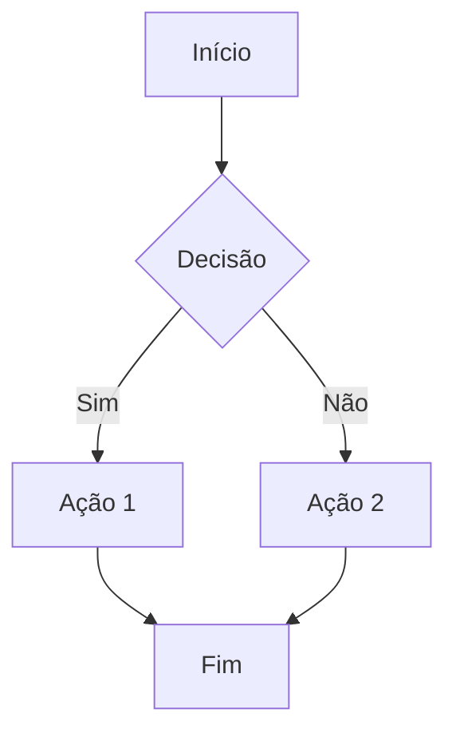
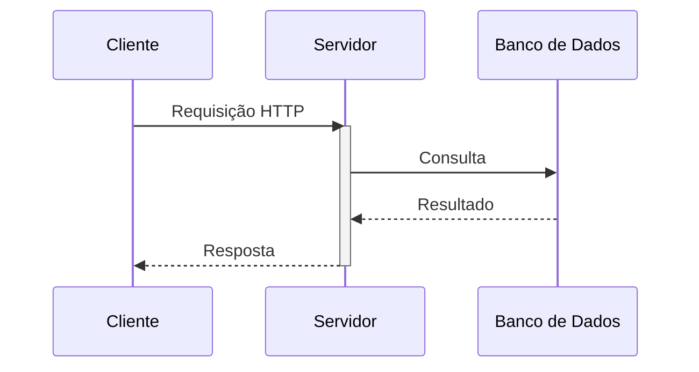
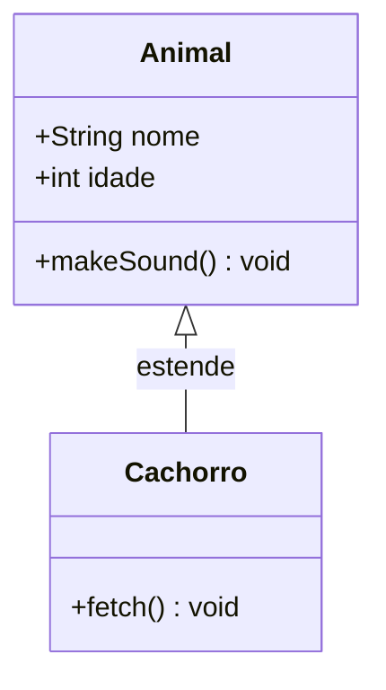
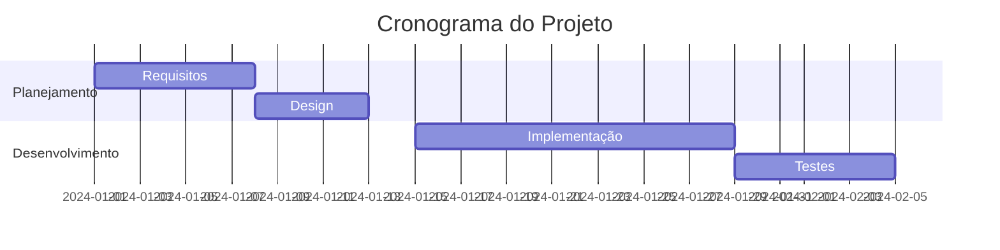
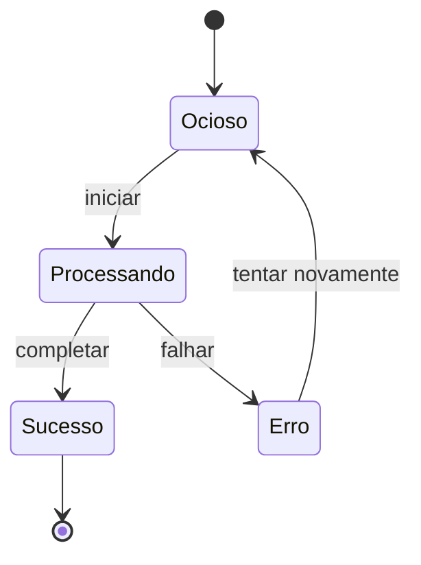
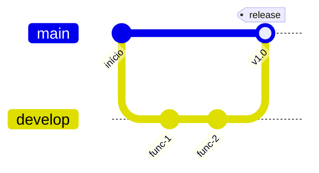
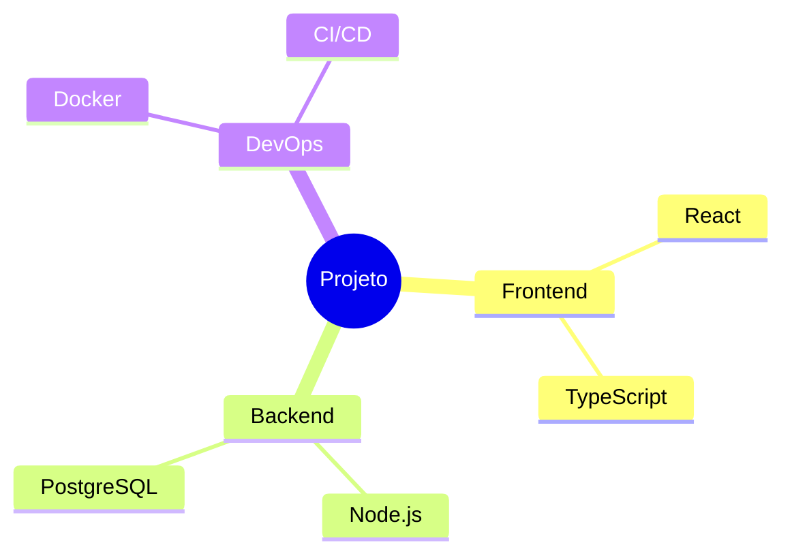
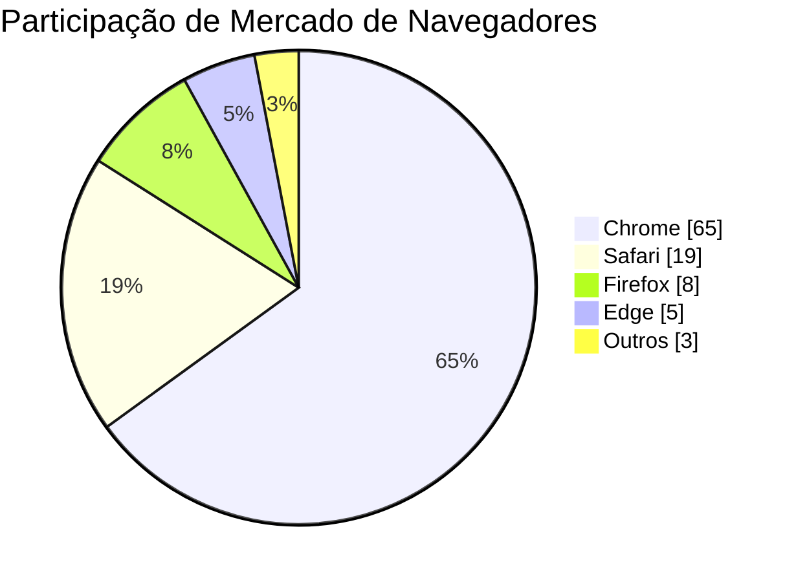
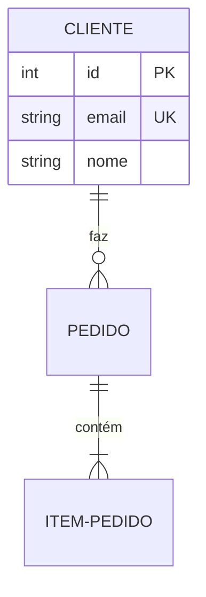
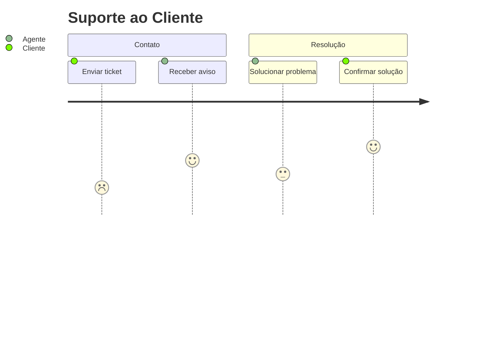

>[!abstract]  O Obsidian possui suporte nativo ao Mermaid. Use blocos de código delimitados com o identificador de linguagem `mermaid`.

## ⚠️ Restrições Específicas do Obsidian

>[!error]  Evite erros com caracteres especiais envolvendo o texto com aspas: "Interação"

>[!warning] **Diferenças de Renderização**: A versão do Mermaid no Obsidian pode estar defasada em relação aos lançamentos do mermaid.js. Alguns recursos de ponta podem não funcionar.

>[!info] **Interação com Temas**: As cores dos diagramas se adaptam ao tema do Obsidian. Use estilos explícitos para uma aparência consistente entre temas.

>[!tip] **Desempenho**: Diagramas muito grandes (mais de 50 nós) podem tornar a renderização lenta. Divida em vários diagramas, se necessário.

>[!important] **Exportação**: A exportação para PDF converte diagramas em imagens. Para compartilhamento externo, capture como PNG/SVG.

>[!check] **Sem JavaScript**: Eventos de clique e callbacks JavaScript são desativados por motivos de segurança.

---

## Guia de Seleção de Diagramas

| Caso de Uso | Tipo de Diagrama | Palavra-chave |
|----------|--------------|---------|
| Fluxo de processo, árvores de decisão | [[#Fluxograma]] | `flowchart` |
| Chamadas de API, passagem de mensagens | [[#Diagrama de Sequência]] | `sequenceDiagram` |
| Design OOP, relacionamentos | [[#Diagrama de Classe]] | `classDiagram` |
| Cronograma de projeto, agendamento | [[#Gráfico de Gantt]] | `gantt` |
| Máquina de estados, ciclo de vida | [[#Diagrama de Estado]] | `stateDiagram-v2` |
| Estratégia de ramificação Git | [[#Gitgraph]] | `gitGraph` |
| Brainstorming, hierarquias | [[#Mapa Mental]] | `mindmap` |
| Proporções, porcentagens | [[#Gráfico de Pizza]] | `pie` |
| Esquema de banco de dados, entidades | [[#Diagrama ER]] | `erDiagram` |
| Etapas de experiência do usuário, satisfação | [[#Jornada do Usuário]] | `journey` |
| Eventos históricos, marcos | [[#Linha do Tempo]] | `timeline` |
| Matriz de prioridade, posicionamento 2D | [[#Gráfico de Quadrante]] | `quadrantChart` |
| Visualização de fluxo, bandas proporcionais | [[#Diagrama Sankey]] | `sankey-beta` |
| Visualização de dados numéricos | [[#Gráfico XY]] | `xychart-beta` |
| Posicionamento preciso de elementos, layouts | [[#Diagrama de Blocos]] | `block-beta` |
| Serviços em nuvem, relacionamentos de serviço | [[#Diagrama de Arquitetura]] | `architecture-beta` |

---

## Exemplos de Início Rápido

### Fluxograma

Código:
````

````

Renderizado:


**Sintaxe principal:**
- Direção: `TD` (top-down), `LR` (left-right), `BT`, `RL`
- Formas: `[retângulo]`, `(arredondado)`, `{diamante}`, `[(cilindro)]`, `((círculo))`
- Setas: `-->`, `-.->` (pontilhada), `==>` (grossa)
- Rótulos: `-->|texto|` ou `-- texto -->`

---

### Diagrama de Sequência

Código:
````

````

Renderizado:


**Sintaxe principal:**
- Setas: `->>` (sincronizada), `-->>` (resposta), `-)` (assíncrona)
- Ativação: `activate`/`deactivate` ou sufixo `+`/`-`
- Controle: `loop`, `alt`/`else`, `opt`, `par`/`and`, `critical`
- Notas: `Note right of A: texto`, `Note over A,B: texto`

---

### Diagrama de Classe

Código:
````

````

Renderizado:


**Sintaxe principal:**
- Visibilidade: `+` público, `-` privado, `#` protegido, `~` pacote
- Relacionamentos: `<|--` herança, `*--` composição, `o--` agregação, `-->` associação
- Métodos: `+método(args) tipoRetorno`

>[!info] [Class diagrams \| Mermaid](https://mermaid.js.org/syntax/classDiagram.html)

---

### Gráfico de Gantt

Código:
````

````

Renderizado:


**Sintaxe principal:**
- `dateFormat`: Formato de data (YYYY-MM-DD, etc.)
- Tarefas: `nome :id, início, duração` ou `nome :after id, duração`
- Modificadores: `done` (concluído), `active` (ativo), `crit` (crítico), `milestone` (marco)

---

### Diagrama de Estado

Código:
````

````

Renderizado:


**Sintaxe principal:**
- Início/Fim: `[*]`
- Transição: `Estado1 --> Estado2 : evento`
- Composto: `state Nome { ... }`
- Bifurcação/Junção: `state nome_bifurcação <<fork>>`, `<<join>>`

---

### Gitgraph

Código:
````

````

Renderizado:


**Sintaxe principal:**
- `commit`: Adicionar commit, opcional `id:`, `tag:`, `type:`
- `branch nome`: Criar branch
- `checkout nome`: Alternar branch
- `merge nome`: Mesclar branch

---

### Mapa Mental

Código:
````

````

Renderizado:


**Sintaxe principal:**
- A indentação define a hierarquia
- Formas: `root((círculo))`, `(arredondado)`, `[quadrado]`, `))nuvem((`
- Use indentação de 4 espaços ou tabulação

---

### Gráfico de Pizza

Código:
````

````

Renderizado:


**Sintaxe principal:**
- `title`: Título opcional do gráfico
- `showData`: Exibir valores nos segmentos
- Formato: `"Rótulo" : valor`

---

### Diagrama ER

Código:
````

````

Renderizado:


**Sintaxe principal:**
- Entidades: `NOME_ENTIDADE`
- Atributos: `tipo nome [PK/FK/UK]`
- Cardinalidade: `||--o{` (um para muitos), `||--||` (um para um)
- Relacionamento: `ENTIDADE1 REL ENTIDADE2 : rótulo`

>[!info] [Entity Relationship Diagrams \| Mermaid](https://mermaid.js.org/syntax/entityRelationshipDiagram.html)

---

### Jornada do Usuário

Código:
````

````

Renderizado:


**Sintaxe principal:**
- Seções: `section nome`
- Tarefas: `Nome da tarefa: pontuação: ator`
- Pontuação: 1-5 (1 = insatisfeito, 5 = satisfeito)
- Atores: Papéis de usuário envolvidos

---

### Linha do Tempo

Código:
````
```mermaid
timeline
    title Roteiro do Produto
    section 2023
        Q1 2023 : Lançamento do MVP
        Q4 2023 : Lançamento da v1.0
    section 2024
        Q2 2024 : Principais funcionalidades
        Q4 2024 : v2.0
```
````

Renderizado:
```mermaid
timeline
    title Roteiro do Produto
    section 2023
        Q1 2023 : Lançamento do MVP
        Q4 2023 : Lançamento da v1.0
    section 2024
        Q2 2024 : Principais funcionalidades
        Q4 2024 : v2.0
```

**Sintaxe principal:**
- Períodos de tempo: `período : evento`
- Seções: Agrupar períodos relacionados
- Múltiplos eventos: `período : evento1 : evento2`
- Formato flexível: Anos, meses, trimestres ou texto personalizado

---

### Gráfico de Quadrante

Código:
````
```mermaid
quadrantChart
    title Priorização de Funcionalidades
    x-axis "Esforço" --> Valor
    y-axis Complexidade --> Impacto
    Modo Escuro: [0.4, 0.7]
    Busca: [0.6, 0.8]
    Exportar PDF: [0.7, 0.6]
    Corrigir Bug de UI: [0.2, 0.3]
```
````

Renderizado:
```mermaid
quadrantChart
    title Priorização de Funcionalidades
    x-axis "Esforço" --> Valor
    y-axis Complexidade --> Impacto
    Modo Escuro: [0.4, 0.7]
    Busca: [0.6, 0.8]
    Exportar PDF: [0.7, 0.6]
    Corrigir Bug de UI: [0.2, 0.3]
```

**Sintaxe principal:**
- Eixos: `x-axis rótulo --> rótulo` e `y-axis rótulo --> rótulo`
- Pontos: `Nome: [x, y]` (coordenadas 0.0-1.0)
- Quadrantes: Auto-divididos em 0.5 em ambos os eixos

---

### Diagrama Sankey

Código:
````
```mermaid
sankey-beta

%% source,target,value
Electricity,Over generation / exports,104.453
Electricity,Heating and cooling - homes,113.726
Electricity,H2 conversion,27.14
```
````

Renderizado:
```mermaid
sankey-beta

Electricity,"Over generation / exports",104.453
Electricity,"Heating and cooling - homes",113.726
Electricity,"H2 conversion",27.14
```

**Sintaxe principal:**
- Formato CSV: `origem, destino, valor`
- Três colunas obrigatórias
- Os valores são numéricos (magnitude do fluxo)
- Nós criados automaticamente a partir de origens/destinos

>[!warning] 
> Ainda está em beta!

>[!info] [Sankey diagram (v10.3.0+) \| Mermaid](https://mermaid.js.org/syntax/sankey.html)

---

### Gráfico XY

Código:
````
```mermaid
xychart-beta
    title "Dados de Vendas"
    x-axis [Jan, Fev, Mar, Abr, Mai]
    y-axis "Receita" 0 --> 100
    line [30, 45, 55, 70, 85]
```
````

Renderizado:
```mermaid
xychart-beta
    title "Dados de Vendas"
    x-axis [Jan, Fev, Mar, Abr, Mai]
    y-axis "Receita" 0 --> 100
    line [30, 45, 55, 70, 85]
```

**Sintaxe principal:**
- Tipo de gráfico: `xychart-beta` ou `xychart-beta horizontal`
- Eixo X: `[categorias]` ou `mín --> máx`
- Eixo Y: `"rótulo" mín --> máx`
- Séries: `line [valores]` ou `bar [valores]`

---

### Diagrama de Blocos

Código:
````
```mermaid
block-beta
    columns 2
    A["Frontend"]:1
    B["Backend"]:1
    C["Banco de Dados"]:2

    style A fill:#e3f2fd,stroke:#1565c0,color:#0d47a1
    style B fill:#f3e5f5,stroke:#7b1fa2,color:#4a148c
    style C fill:#e8f5e9,stroke:#2e7d32,color:#1b5e20
```
````

Renderizado:
```mermaid
block-beta
    columns 2
    A["Frontend"]:1
    B["Backend"]:1
    C["Banco de Dados"]:2

    style A fill:#e3f2fd,stroke:#1565c0,color:#0d47a1
    style B fill:#f3e5f5,stroke:#7b1fa2,color:#4a148c
    style C fill:#e8f5e9,stroke:#2e7d32,color:#1b5e20
```

**Sintaxe principal:**
- Blocos: `ID["Rótulo"]:SPAN` - Cada bloco em uma nova linha
- Colunas: `columns N` - Definir largura do layout
- Estilização: `style ID fill:#hex,stroke:#hex,color:#hex`
- Spans: sufixo `:N` - Quantas colunas o bloco ocupa

---

### Diagrama de Arquitetura

Código:
````
```mermaid
architecture-beta
    group Cloud(cloud)[Infraestrutura em Nuvem]
    service web(server)[Servidor Web] in Cloud
    service api(server)[Servidor API] in Cloud
    service db(database)[Banco de Dados]

    web:R --> L:api
    api:R --> L:db
```
````

Renderizado:
```mermaid
architecture-beta
    group Cloud(cloud)[Infraestrutura em Nuvem]
    service web(server)[Servidor Web] in Cloud
    service api(server)[Servidor API] in Cloud
    service db(database)[Banco de Dados]

    web:R --> L:api
    api:R --> L:db
```

**Sintaxe principal:**
- Grupos: `group {id}({ícone})[{rótulo}]` - Organizar serviços
- Serviços: `service {id}({ícone})[{rótulo}] (in {pai})?` - Ícones disponíveis: server, database, cloud, disk, internet
- Aninhamento: `in {id_pai}` - Colocar serviço/grupo dentro do grupo pai
- Conexões: `{id1}:{pos} {seta} {pos}:{id2}` - Posição: L(eft/Esquerda), R(ight/Direita), T(op/Topo), B(ottom/Base)
- Setas: `-->` (direita), `<--` (esquerda), `--` (ambas)

---

## Padrões Comuns

### Adicionando Estilos

Código:
````
```mermaid
flowchart LR
    A[Normal] --> B[Estilizado]
    style B fill:#f96,stroke:#333,stroke-width:2px
```
````

Renderizado:
```mermaid
flowchart LR
    A[Normal] --> B[Estilizado]
    style B fill:#f96,stroke:#333,stroke-width:2px
```

### Usando Classes

Código:
````
```mermaid
flowchart LR
    A:::highlight --> B --> C:::highlight
    classDef highlight fill:#ff0,stroke:#f00,stroke-width:2px
```
````

Renderizado:
```mermaid
flowchart LR
    A:::highlight --> B --> C:::highlight
    classDef highlight fill:#ff0,stroke:#f00,stroke-width:2px
```

### Comentários

Código:
````
```mermaid
flowchart TD
    %% Isso é um comentário
    A --> B
```
````

Renderizado:
```mermaid
flowchart TD
    %% Isso é um comentário
    A --> B
```

---

## Referência

- [Sintaxe de Diagrama \| Mermaid](https://mermaid.js.org/intro/syntax-reference.html)
- [Editor Online de Fluxogramas e Diagramas - Mermaid Live Editor](https://mermaid.live/edit)
