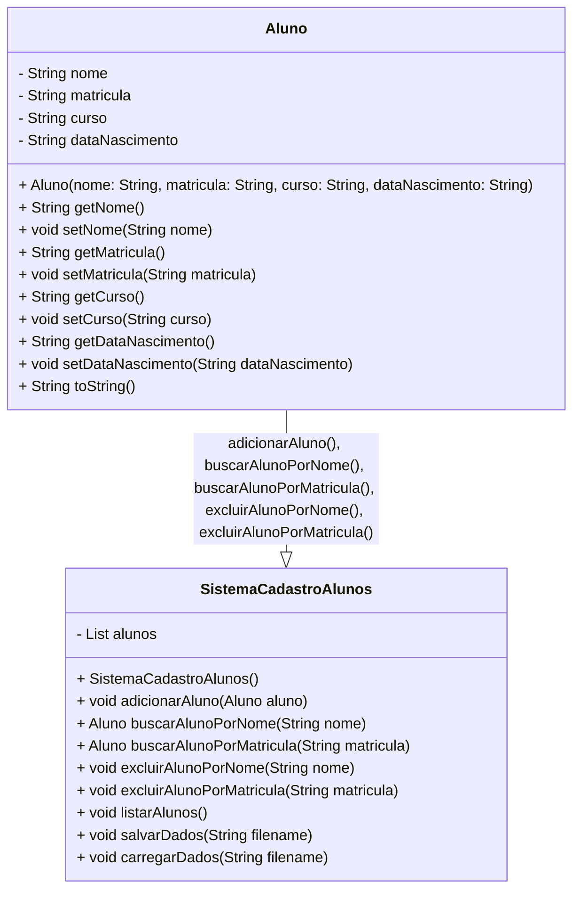
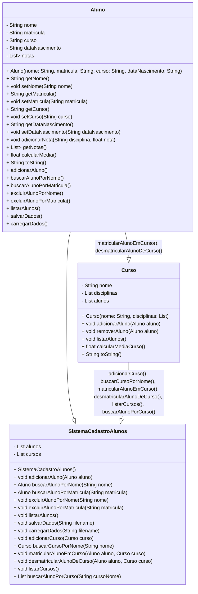

## Desafio de Programação em Python: Sistema de Cadastro de Alunos

**Objetivo:**

Criar um aplicativo em Python que funcione como um sistema de cadastro de alunos para uma escola. O sistema deve permitir a inserção, consulta e exclusão de dados dos alunos.

**Funcionalidades:**

- **Menu principal:** Apresentar um menu com as opções:
    - **Cadastrar aluno:** Permitir a inserção de dados do aluno, incluindo nome, matrícula, curso e data de nascimento.
    - **Consultar aluno:** Buscar um aluno por nome ou matrícula e exibir seus dados completos.
    - **Excluir aluno:** Remover um aluno do sistema por nome ou matrícula.
    - **Sair:** Encerrar o programa.
- **Validação de dados:** Garantir que os dados inseridos sejam válidos e consistentes.
- **Armazenamento de dados:** Armazenar os dados dos alunos em uma estrutura de dados adequada (lista, dicionário, etc.).
- **Interface amigável:** Criar uma interface amigável e intuitiva para o usuário.

**Desafios adicionais:**

- **Implementar pesquisa por curso:** Permitir ao usuário buscar alunos por curso.
- **Gerar relatórios:** Criar funcionalidades para gerar relatórios com a lista de alunos, ordenados por nome, curso ou data de nascimento.
- **Salvar e carregar dados:** Implementar a funcionalidade de salvar os dados dos alunos em um arquivo e carregá-los ao iniciar o programa.
- **Interface gráfica:** Criar uma interface gráfica para o sistema, utilizando bibliotecas como Tkinter ou PyQt.

**Recursos:**

- Documentação oficial do Python: [https://www.python.org/doc/](https://www.python.org/doc/)
- Tutoriais de Python: [https://realpython.com/](https://realpython.com/)
- Exemplos de código: [https://github.com/topics/python-examples](https://github.com/topics/python-examples)
- Comunidade Python: [https://stackoverflow.com/questions/tagged/python](https://stackoverflow.com/questions/tagged/python)

**Observações:**

- Este desafio pode ser adaptado para diferentes níveis de conhecimento em Python.
- A implementação das funcionalidades adicionais é opcional.
- O foco principal deve ser na lógica de programação e na organização do código.

## **Exemplo de código (base)**

```py
def main():
    while True:
        print("\nMenu Principal:")
        print("1. Cadastrar Aluno")
        print("2. Consultar Aluno")
        print("3. Excluir Aluno")
        print("4. Sair")

        opcao = input("Digite sua opção: ")

        if opcao == "1":
            cadastrar_aluno()
        elif opcao == "2":
            consultar_aluno()
        elif opcao == "3":
            excluir_aluno()
        elif opcao == "4":
            break
        else:
            print("Opção inválida!")

def cadastrar_aluno():
    # Implementar a funcionalidade de cadastro de aluno
    pass

def consultar_aluno():
    # Implementar a funcionalidade de consulta de aluno
    pass

def excluir_aluno():
    # Implementar a funcionalidade de exclusão de aluno
    pass

if __name__ == "__main__":
    main()
```

## Usando POO

### Desafio de Programação em Python: Sistema de Cadastro de Alunos (Orientação a Objetos)

**Objetivo:**

Reimplementar o sistema de cadastro de alunos utilizando os conceitos de Programação Orientada a Objetos (POO) em Python.

### Diagrama UML de Classes - Sistema de Cadastro de Alunos (Python)

Snippet de código



**Explicação do Diagrama:**

- **Classes:**
    - **Aluno:** Representa um aluno com seus atributos (nome, matrícula, curso, data de nascimento) e métodos para acessar e modificar esses atributos, além de um método `to_string()` para retornar uma representação textual do aluno.
    - **SistemaCadastroAlunos:** Gerencia as operações do sistema de cadastro de alunos, possuindo uma lista de objetos Aluno (`alunos`) e métodos para:
        - Adicionar um novo aluno (`adicionar_aluno(aluno)`).
        - Buscar um aluno por nome (`buscar_aluno_por_nome(nome)`) ou matrícula (`buscar_aluno_por_matricula(matricula)`) e retornar o objeto Aluno ou None se não encontrado.
        - Excluir um aluno da lista por nome (`excluir_aluno_por_nome(nome)`) ou matrícula (`excluir_aluno_por_matricula(matricula)`).
        - Listar todos os alunos cadastrados (`listar_alunos()`).
        - Salvar os dados dos alunos em um arquivo (`salvar_dados(filename)`).
        - Carregar os dados dos alunos de um arquivo (`carregar_dados(filename)`).
- **Relacionamentos:**
    - A classe `Aluno` está associada à classe `SistemaCadastroAlunos` por meio de uma agregação. Isso significa que um objeto Aluno pode existir independentemente do sistema de cadastro, mas o sistema de cadastro precisa de uma lista de objetos Aluno para funcionar.
    - As setas no diagrama indicam a navegabilidade das associações. As setas que partem da classe `Aluno` e apontam para a classe `SistemaCadastroAlunos` indicam que os métodos da classe `SistemaCadastroAlunos` (como `adicionar_aluno()`, `buscar_aluno_por_nome()`, etc.) podem acessar e modificar os atributos dos objetos Aluno.

**Observações:**

- Este é um diagrama UML básico que representa as classes e seus relacionamentos principais. Um diagrama UML mais completo pode incluir outros detalhes, como métodos privados, herança e interfaces.
- A implementação dos métodos das classes não está representada no diagrama UML.
- Este diagrama serve como um guia visual para entender a estrutura do sistema de cadastro de alunos orientado a objetos.

**Espero que este diagrama de classes seja útil para a sua compreensão do sistema!**


**Classes:**

- **Aluno:** Representar um aluno com seus atributos (nome, matrícula, curso, data de nascimento).
    - Métodos:
        - `__init__(self, nome, matricula, curso, data_nascimento)`: Construtor para inicializar um objeto Aluno.
        - `get_nome(self)`: Retorna o nome do aluno.
        - `set_nome(self, novo_nome)`: Define um novo nome para o aluno.
        - `get_matricula(self)`: Retorna a matrícula do aluno.
        - `set_matricula(self, nova_matricula)`: Define uma nova matrícula para o aluno.
        - `get_curso(self)`: Retorna o curso do aluno.
        - `set_curso(self, novo_curso)`: Define um novo curso para o aluno.
        - `get_data_nascimento(self)`: Retorna a data de nascimento do aluno.
        - `set_data_nascimento(self, nova_data_nascimento)`: Define uma nova data de nascimento para o aluno.
        - `to_string(self)`: Retorna uma string com a representação textual do aluno.
- **SistemaCadastroAlunos:** Gerenciar as operações do sistema de cadastro de alunos.
    - Atributos:
        - `alunos`: Uma lista para armazenar os objetos Aluno.
    - Métodos:
        - `__init__(self)`: Construtor para inicializar o sistema.
        - `adicionar_aluno(self, aluno)`: Adiciona um novo aluno à lista.
        - `buscar_aluno_por_nome(self, nome)`: Busca um aluno por nome e retorna o objeto Aluno ou None se não encontrado.
        - `buscar_aluno_por_matricula(self, matricula)`: Busca um aluno por matrícula e retorna o objeto Aluno ou None se não encontrado.
        - `excluir_aluno_por_nome(self, nome)`: Exclui um aluno da lista por nome.
        - `excluir_aluno_por_matricula(self, matricula)`: Exclui um aluno da lista por matrícula.
        - `listar_alunos(self)`: Exibe uma lista com todos os alunos cadastrados.
        - `salvar_dados(self, filename)`: Salva os dados dos alunos em um arquivo no formato especificado.
        - `carregar_dados(self, filename)`: Carrega os dados dos alunos de um arquivo no formato especificado.

### **Exemplo de código:**

```py
class Aluno:
    def __init__(self, nome, matricula, curso, data_nascimento):
        self.nome = nome
        self.matricula = matricula
        self.curso = curso
        self.data_nascimento = data_nascimento

    def get_nome(self):
        return self.nome

    def set_nome(self, novo_nome):
        self.nome = novo_nome

    def get_matricula(self):
        return self.matricula

    def set_matricula(self, nova_matricula):
        self.matricula = nova_matricula

    def get_curso(self):
        return self.curso

    def set_curso(self, novo_curso):
        self.curso = novo_curso

    def get_data_nascimento(self):
        return self.data_nascimento

    def set_data_nascimento(self, nova_data_nascimento):
        self.data_nascimento = nova_data_nascimento

    def to_string(self):
        return f"Nome: {self.nome}\nMatrícula: {self.matricula}\nCurso: {self.curso}\nData de Nascimento: {self.data_nascimento}"

class SistemaCadastroAlunos:
    def __init__(self):
        self.alunos = []

    def adicionar_aluno(self, aluno):
        self.alunos.append(aluno)

    def buscar_aluno_por_nome(self, nome):
        for aluno in self.alunos:
            if aluno.get_nome().lower() == nome.lower():
                return aluno
        return None

    def buscar_aluno_por_matricula(self, matricula):
        for aluno in self.alunos:
            if aluno.get_matricula() == matricula:
                return aluno
```

## Sistema de Cadastro de Alunos com Cursos e Notas (POO)

**Objetivo:**

Aprimorar o sistema de cadastro de alunos para incluir o gerenciamento de cursos e notas.

### Diagrama de classes



**Explicação do Diagrama:**

- **Classes:**
    - **Aluno:**
        - Atributos:
            - `nome`, `matricula`, `curso`, `dataNascimento`, `notas` (como antes).
        - Métodos:
            - (Métodos de acesso e modificação para atributos e métodos existentes).
            - `adicionar_nota(disciplina, nota)`: Adiciona uma nova nota à lista de notas do aluno.
            - `get_notas()`: Retorna a lista de notas do aluno.
            - `calcular_media()`: Calcula e retorna a média geral das notas do aluno.
            - `to_string()`: Retorna uma string com a representação textual do aluno, incluindo suas notas.
    - **Curso:**
        - Atributos:
            - `nome`: Nome do curso.
            - `disciplinas`: Uma lista de strings contendo as disciplinas do curso.
            - `alunos`: Uma lista de objetos Aluno matriculados no curso.
        - Métodos:
            - `__init__(self, nome, disciplinas)`: Construtor para inicializar um objeto Curso.
            - `adicionar_aluno(self, aluno)`: Adiciona um aluno à lista de alunos matriculados no curso.
            - `remover_aluno(self, aluno)`: Remove um aluno da lista de alunos matriculados no curso.
            - `listar_alunos(self)`: Exibe uma lista com os alunos matriculados no curso.
            - `calcular_media_curso(self)`: Calcula e retorna a média geral das notas de todos os alunos matriculados no curso.
            - `to_string(self)`: Retorna uma string com a representação textual do curso, incluindo seus alunos e disciplinas.
    - **SistemaCadastroAlunos:**
        - Atributos:
            - `alunos`: Uma lista de objetos Aluno (como antes).
            - `cursos`: Uma lista de objetos Curso.
        - Métodos:
            - (Métodos de gerenciamento de alunos permanecem os mesmos).
            - `adicionar_curso(self, curso)`: Adiciona um novo curso


**Classes:**

- **Aluno:**
    - Atributos:
        - `nome`, `matricula`, `curso`, `data_nascimento` (como antes).
        - `notas`: Uma lista de dicionários contendo as notas do aluno em cada disciplina, por exemplo:Python
            
            ```
            notas = [
                {"disciplina": "Matemática", "nota": 7.5},
                {"disciplina": "Português", "nota": 8.2},
                {"disciplina": "História", "nota": 9.0},
            ]
            ```
            
    - Métodos:
        - (Métodos de acesso e modificação para os atributos `nome`, `matricula`, `curso` e `data_nascimento` permanecem os mesmos).
        - `adicionar_nota(self, disciplina, nota)`: Adiciona uma nova nota à lista de notas do aluno.
        - `get_notas(self)`: Retorna a lista de notas do aluno.
        - `calcular_media(self)`: Calcula e retorna a média geral das notas do aluno.
        - `to_string(self)`: Retorna uma string com a representação textual do aluno, incluindo suas notas.
- **Curso:**
    - Atributos:
        - `nome`: Nome do curso.
        - `disciplinas`: Uma lista de strings contendo as disciplinas do curso.
        - `alunos`: Uma lista de objetos Aluno matriculados no curso.
    - Métodos:
        - `__init__(self, nome, disciplinas)`: Construtor para inicializar um objeto Curso.
        - `adicionar_aluno(self, aluno)`: Adiciona um aluno à lista de alunos matriculados no curso.
        - `remover_aluno(self, aluno)`: Remove um aluno da lista de alunos matriculados no curso.
        - `listar_alunos(self)`: Exibe uma lista com os alunos matriculados no curso.
        - `calcular_media_curso(self)`: Calcula e retorna a média geral das notas de todos os alunos matriculados no curso.
        - `to_string(self)`: Retorna uma string com a representação textual do curso, incluindo seus alunos e disciplinas.
- **SistemaCadastroAlunos:**
    - Atributos:
        - `alunos`: Uma lista de objetos Aluno (como antes).
        - `cursos`: Uma lista de objetos Curso.
    - Métodos:
        - (Métodos de gerenciamento de alunos permanecem os mesmos).
        - `adicionar_curso(self, curso)`: Adiciona um novo curso à lista de cursos.
        - `buscar_curso_por_nome(self, nome)`: Busca um curso por nome e retorna o objeto Curso ou None se não encontrado.
        - `matricular_aluno_em_curso(self, aluno, curso)`: Matricula um aluno em um curso.
        - `desmatricular_aluno_de_curso(self, aluno, curso)`: Desmatricula um aluno de um curso.
        - `listar_cursos(self)`: Exibe uma lista com todos os cursos cadastrados.
        - `buscar_aluno_por_curso(self, curso_nome)`: Busca todos os alunos matriculados em um curso específico.
        - (Outros métodos podem ser implementados, como salvar e carregar dados de cursos e alunos em arquivos).

### **Exemplo de código (métodos adicionados):**


```py
class Aluno:
    # ... (Métodos de acesso e modificação para atributos e métodos existentes)

    def adicionar_nota(self, disciplina, nota):
        if 0 <= nota <= 10:
            self.notas.append({"disciplina": disciplina, "nota": nota})
        else:
            print(f"Erro: Nota inválida ({nota}). Deve estar entre 0 e 10.")

    def get_notas(self):
        return self.notas

    def calcular_media(self):
        if len(self.notas) == 0:
            return 0.0
        else:
            media = sum(nota["nota"] for nota in self.notas) / len(self.notas)
            return media

    def to_string(self):
        # ... (Exibir informações do aluno e suas notas)

class Curso:
    def __init__(self, nome, disciplinas):
        self.nome = nome
```

