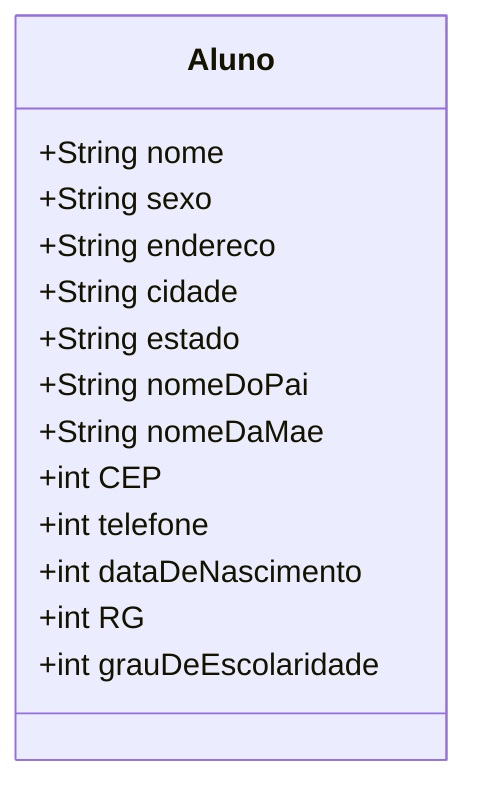
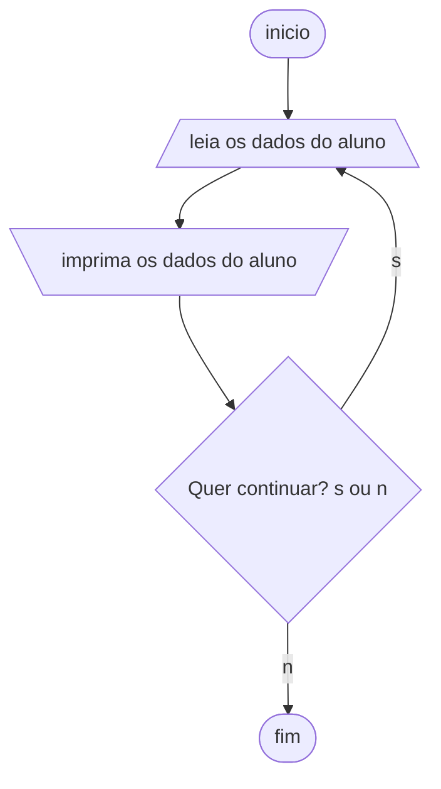
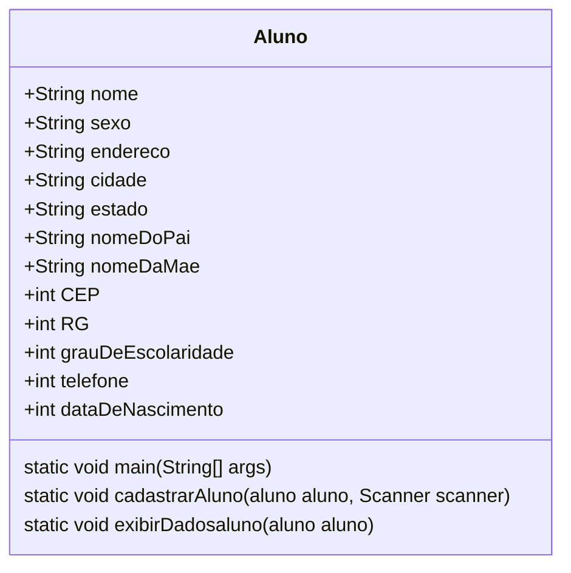

## Fase 1 Cap. 2

Criar um aplicativo em Python que represente um sistema de cadastro de alunos.

Iniciando a proposta, que é construir um sistema de informação, declare as variáveis para o algoritmo de cadastramento de alunos, cujos dados são:

- nome,
- sexo,
- endereço,
- cidade,
- estado,
- CEP,
- telefone,
- data de nascimento,
- RG,
- nome do pai,
- nome da mãe
- grau de escolaridade

Classifique os dados segundo os tipos das variáveis (numéricos, literais ou lógicos) que irão armazená-los.

- Variáveis literais: nome do aluno, sexo, endereço, cidade, estado, nome do pai, nome da mãe.
- Variáveis numéricas: telefone, CEP, RG, data de nascimento, grau de escolaridade.

## Diagrama de classe

## Fase2 cap. 4

Atribuição de valores às variáveis:

O usuário entra com valores para preencher as variáveis:

- leia "Entre com o sexo:", SEXO
- leia "Entre com o endereço:", ENDERECO
- leia "Entre com a cidade onde o aluno reside:", CIDADE
- leia "Entre com a sigla do estado onde o aluno reside:", UF
- leia "Entre com o CEP (somente números):", CEP
- leia "Entre com o telefone (somente números):", FONE
- leia "Entre com o nome do pai do aluno:", PAI
- leia "Entre com o nome da mãe do aluno:", MAE
- leia "Entre com o Registro Geral (RG) do aluno (somente números)
- leia "Entre com o grau de escolaridade do aluno (0, 1, 2, 3):", GRAUESC
- escreva "Aluno:", NOME
- escreva "Sexo:", SEXO, "Data de Nascimento:", DATANASC
- escreva "Registro Geral (RG):", RG
- escreva "Grau de escolaridade:", GRAUESC, "grau"
- escreva "Endereço:", ENDERECO, "Cidade:", CIDADE, "Estado:", UF
- escreva "CEP:", CEP
- escreva "Telefone:", FONE
- escreva "Nome do pai:", PAI
- escreva "Nome da mãe:", MAE

Cadastrar 50 alunos significa repetir o algoritmo anterior cinquenta vezes, ou seja, utilizar uma estrutura de repetição; neste caso, utilize a estrutura para/faça/fim-para. Para controlar a quantidade de alunos cadastrados, você deve utilizar uma variável contadora. Antes disso, porém, todas as variáveis do algoritmo devem ser declaradas.

Para criar um aplicativo em Python que cadastre 50 alunos usando uma estrutura de repetição, você pode utilizar o laço `for` para iterar 50 vezes. Aqui está o código atualizado:

Nesse código, o laço `for` é usado para repetir o processo de cadastro 50 vezes. A cada iteração, um novo objeto `Aluno` é criado e preenchido com os dados fornecidos pelo usuário. Em seguida, os dados são exibidos na tela.

Lembre-se de que é uma boa prática seguir as convenções de nomenclatura do Python, portanto, o nome da classe `aluno` foi alterado para `Aluno`, começando com letra maiúscula.

Imagine quanto trabalho seu amigo terá para controlar todas as fichas. Para ajudá-lo, você pode desenvolver um programa de computador. Antes, porém, deve criar um algoritmo, seguindo algumas etapas.

## Fase 3 Usando funções

- Refatorar o algoritmo anterior usando funções para separar a lógica em partes mais organizadas e reutilizáveis.
- Colocar uma opção para sair do loop.

## Diagramas

Diagrama de fluxo

Diagrama de classe:

## Referências

- Xavier, Gley Fabiano Cardoso Lógica de programação E-book, capítulos 2, 4 e 8. Disponível em: <[bibliotecadigitalsenac](https://bibliotecadigitalsenac.com.br/#/content/uid/52c1e038-17d8-ee11-85fa-00224821b803/detail)> Acesso em 01/10/2026
- [Editor de diagramas Mermaid](https://mermaid.live/)

%%  %%
