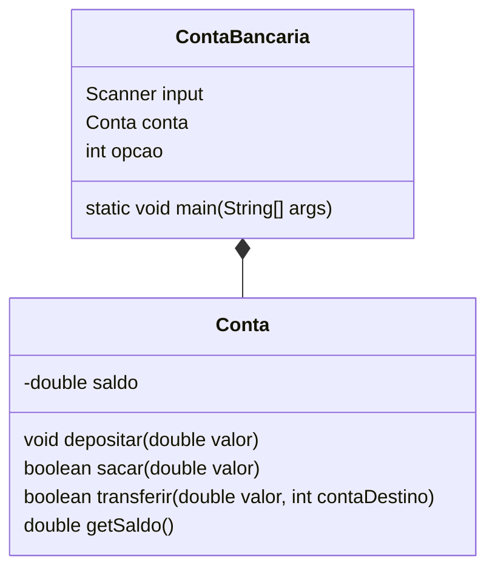

Criar um aplicativo em Python que represente um sistema de controle de contas correntes bancárias de um correntista.

- Conta: porque seriam movimentadas uma ou várias contas. Para isso, serão necessários os seguintes dados (número, banco, saldo, etc.) para realizar operações de crédito, débito, entre outras operações bancárias nas contas.
- Banco: porque poderia ter um ou mais bancos a quem essas contas pertencessem.
Correntista: porque toda conta pertence a uma pessoa no mundo real e geralmente têm atrelado a elas seus dados (nome, endereço, fone, documento de identidade, CPF, etc.).

## Programação estruturada

Exemplo de um programa de conta de banco, com depósito, saque e transferência

## Usando funções

Neste exemplo, as operações de depósito, saque e transferência foram transformadas em funções que recebem o saldo atual e os valores necessários para realizar as operações e retornam o novo saldo após a operação. Na classe principal, as funções são chamadas de forma correspondente a cada operação. Todas as operações são realizadas por meio das funções.

## Usando Programação orientada a objetos

### Diagrama UML de classe

Essas características devem estar presentes na classe e são chamadas de Atributos. Veja o diagrama a seguir que representa a classe conta, assim como alguns atributos:

Implementação:

Neste exemplo, criamos uma classe Conta que possui os métodos depositar, sacar, transferir e para realizar as operações na conta bancária. No método principal, criamos um objeto da classe Conta e usamos seus métodos para realizar as operações de depósito, saque, transferência e consulta de saldo. As operações de saque e transferência verificam se há saldo suficiente na conta antes de realizar a operação e retornam um valor booleano indicando se a operação foi realizada com sucesso ou não.

## Referências

- [GitHub: Conta-poo em Java](https://github.com/jocile/conta-poo);
- [jocile/aulas em 2023/ criando aplicação conta bancaria em Java](https://jocile.github.io/aulas/posts/criando-aplicacao-conta-bancaria/)

%%

%%
