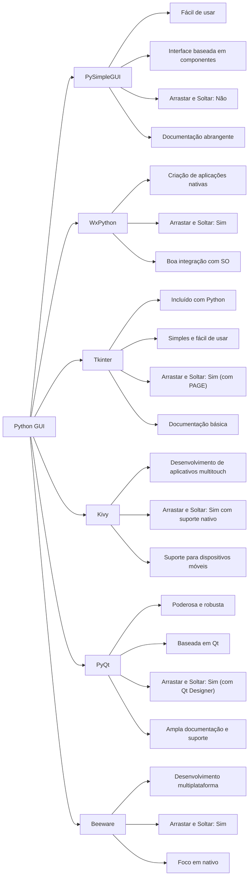

**Se você está buscando uma interface gráfica em Python com recursos de arrastar e soltar similar ao Delphi, algumas opções se destacam:**

## Tabela comparativa

Tabela comparativa com os links para a documentação dos editores de interface gráfica do Python:

| Editor      | Descrição                                       | Arrastar e Soltar       | Documentação              | Observações Adicionais                       |
| ----------- | ----------------------------------------------- | ----------------------- | ------------------------- | -------------------------------------------- |
| PySimpleGUI | Fácil de usar, interface baseada em componentes | Não                     | [Abrangente][PySimpleGUI] | Ideal para iniciantes                        |
| WxPython    | Criação de aplicações nativas                   | Sim                     | [Boa][WxPython]           | Boa integração com SO                        |
| Tkinter     | Incluído com Python, simples e fácil de usar    | Sim ("com PAGE")        | [Básica][Tkinter]         | Popular e amplamente utilizado               |
| Kivy        | Desenvolvimento de aplicativos multitouch       | Sim (suporte nativo)    | [Adequada][Kivy]          | Suporte para dispositivos móveis             |
| PyQt        | Poderosa e robusta, baseada em Qt               | Sim ("com Qt Designer") | [Ampla][PyQt]             | Ampla documentação e suporte                 |
| Beeware     | Desenvolvimento multiplataforma                 | Sim                     | [Boa][Beeware]            | Foco em nativo, suporte a várias plataformas |
| AppJar      | Simples e fácil de usar                         | Não                     | [Básica][AppJar]          | Bom para projetos pequenos e rápidos         |
| Flexx       | Baseado em navegador, uso de widgets            | Não                     | [Adequada][Flexx]         | Interfaces web interativas                   |

> [!NOTE]
> Nesta tabela, cada editor é descrito em termos de facilidade de uso, presença de recursos de arrastar e soltar, qualidade da documentação com links para a documentação oficial, e observações adicionais sobre suas características e uso.
> 

## **1. Kivy**

- **Arrastar e soltar:**O [Kivy][Kivy] oferece suporte nativo para eventos de arrastar e soltar, permitindo que você crie interfaces interativas com elementos que podem ser movidos e redimensionados facilmente.
- **Desenvolvimento multiplataforma:** O [Kivy][Kivy] permite criar interfaces que podem ser executadas em diversas plataformas, como Windows, macOS, Linux, Android e iOS.
- **Comunidade ativa:** O [Kivy][Kivy] possui uma comunidade grande e ativa de desenvolvedores, o que significa que você encontrará facilmente suporte e recursos online.

## **2. PyQt**

- **Integração com Qt:**O [PyQt][PyQt] oferece acesso ao poderoso framework Qt, que fornece recursos avançados para criar interfaces gráficas complexas e com alta performance.
- **Designer GUI:** O [PyQt][PyQt] inclui um designer GUI visual que facilita a criação de interfaces gráficas arrastando e soltando elementos.
- **Flexibilidade:** O [PyQt][PyQt] oferece grande flexibilidade para personalizar a aparência e o comportamento da sua interface gráfica.

## **3. BeeWare**

- **Simplicidade:**O [BeeWare][Beeware] é uma biblioteca leve e fácil de usar, ideal para iniciantes que desejam criar interfaces gráficas simples e rápidas.
- **Baseado na web:** O [BeeWare][Beeware] utiliza o navegador web como interface gráfica, o que a torna portátil e multiplataforma por natureza.
- **Arrastar e soltar:** O [BeeWare][Beeware] oferece suporte para eventos de arrastar e soltar, permitindo a criação de interfaces interativas.

## **4. AppJar**

- **Facilidade de uso:** O [AppJar][AppJar] foi projetado para ser extremamente fácil de usar, com uma sintaxe simples e intuitiva em Python.
- **Interface gráfica completa:** O [AppJar][AppJar] oferece diversos componentes para criar interfaces gráficas completas, como botões, caixas de texto, menus e gráficos.
- **Multiplataforma:** O [AppJar][AppJar] pode ser usado para criar interfaces que podem ser executadas em Windows, macOS e Linux.

## **5. Flexx**

- **Altamente interativo:**O [Flexx][Flexx] é especializado na criação de interfaces gráficas altamente interativas e dinâmicas, utilizando animações e efeitos visuais.
- **Baseado em reações:** O [Flexx][Flexx] utiliza um paradigma de programação baseado em reações, facilitando a criação de interfaces responsivas e adaptáveis.
- **Desenvolvimento avançado:** O [Flexx][Flexx] é mais adequado para desenvolvedores experientes que desejam criar interfaces gráficas complexas e personalizadas.

> [!NOTE]
> **A escolha da biblioteca ideal dependerá das suas necessidades específicas e do seu nível de experiência em programação.**
> 
> **Recomendo que você explore a documentação e tutoriais online de cada biblioteca para ter uma melhor compreensão de seus recursos e funcionalidades.**
> 
> **Lembre-se de que a melhor maneira de aprender a usar uma biblioteca de interface gráfica é através da prática.** Comece com projetos simples e vá aumentando a complexidade à medida que você se familiariza com a biblioteca.

Veja também: [Best Python GUI Libraries Compared! (PyQt, Kivy, Tkinter, PySimpleGUI, WxPython & PySide) - YouTube](https://www.youtube.com/watch?v=Q72b6tDQMKQ)

[PySimpleGUI]: https://pysimplegui.readthedocs.io/
[WxPython]: https://wxpython.org/pages/docs/index.html
[Tkinter]: https://docs.python.org/3/library/tkinter.html
[Kivy]: https://kivy.org/doc/stable/
[PyQt]: https://www.riverbankcomputing.com/static/Docs/PyQt5/
[Beeware]: https://docs.beeware.org/en/latest/
[AppJar]: http://appjar.info/
[Flexx]: https://flexx.readthedocs.io/en/stable/
