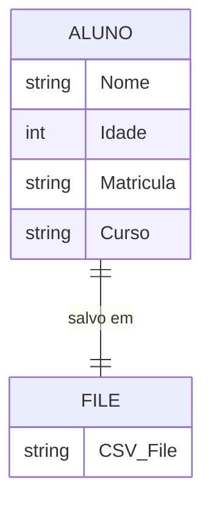

Arquivos CSV são amplamente utilizados para armazenar dados tabulares. Python fornece o módulo `csv` para facilitar a leitura e escrita desses arquivos.

#### Lendo Arquivos CSV

**Exemplo de Código:**

```python
import csv

with open('dados.csv', newline='') as csvfile:
    leitor = csv.reader(csvfile)
    for linha in leitor:
        print(linha)
```

#### Escrevendo em Arquivos CSV

**Exemplo de Código:**

```python
import csv

with open('dados.csv', 'w', newline='') as csvfile:
    escritor = csv.writer(csvfile)
    escritor.writerow(['Nome', 'Idade'])
    escritor.writerow(['Alice', 30])
```

## Exemplo

Vamos abordar o problema proposto em várias etapas, começando pelo pseudocódigo para o algoritmo de cadastramento de alunos utilizando a estrutura de registros. Em seguida, implementaremos o código em Python para manipulação de arquivos CSV.

### Cadastramento de alunos

- Monte o algoritmo de cadastramento de alunos utilizando a estrutura de registros. 
- Represente o algoritmo em pseudocódigo. 
- Montar um algoritmo de cadastramento de alunos utilizando a estrutura de registros. 
- Represente o algoritmo em pseudocódigo, e o código em Python para fazer um formulário, salvando em arquivo texto. Segue abaixo o pseudocódigo para o algoritmo de cadastramento de alunos utilizando a estrutura de registros, seguido do código em Python e salvar as informações em um arquivo de texto csv: 
	- Pseudocódigo: Definir a estrutura de registro para o aluno, contendo os campos nome, idade, matrícula e curso. Inicializar as variáveis de entrada nome, idade, matrícula e curso.
	- Criar um formulário com campos de entrada para nome, idade, matrícula e curso. 
	- Ler as informações de entrada do usuário e armazená-las nas variáveis correspondentes. 
	- Criar um objeto do tipo Aluno com as informações armazenadas nas variáveis. 
	- Escrever as informações do objeto Aluno em um arquivo de texto em csv. 
	- Exibir uma mensagem de confirmação para o usuário.

Diagrama:


### Pseudocódigo

```plaintext
1. Definir a estrutura de registro para o aluno:
    - Nome
    - Idade
    - Matrícula
    - Curso

2. Inicializar as variáveis de entrada:
    - nome
    - idade
    - matrícula
    - curso

3. Criar um formulário com campos de entrada para:
    - nome
    - idade
    - matrícula
    - curso

4. Ler as informações de entrada do usuário e armazená-las nas variáveis correspondentes:
    - nome = ler entrada do usuário
    - idade = ler entrada do usuário
    - matrícula = ler entrada do usuário
    - curso = ler entrada do usuário

5. Criar um objeto do tipo Aluno com as informações armazenadas:
    - aluno = {nome, idade, matrícula, curso}

6. Escrever as informações do objeto Aluno em um arquivo de texto em formato CSV:
    - abrir arquivo 'alunos.csv' no modo 'a'
    - escrever {nome, idade, matrícula, curso} no arquivo
    - fechar arquivo

7. Exibir uma mensagem de confirmação para o usuário:
    - exibir "Aluno cadastrado com sucesso!"
```

### Implementação em Python

#### Passo 1: Definição da Estrutura de Registro e Cadastro de Aluno

**Código em Python:**

```python
import csv

def cadastrar_aluno():
    # Solicitar informações do aluno
    nome = input("Digite o nome do aluno: ")
    idade = input("Digite a idade do aluno: ")
    matricula = input("Digite a matrícula do aluno: ")
    curso = input("Digite o curso do aluno: ")

    # Estrutura de registro para o aluno
    aluno = {
        'Nome': nome,
        'Idade': idade,
        'Matrícula': matricula,
        'Curso': curso
    }

    # Escrever as informações no arquivo CSV
    with open('alunos.csv', 'a', newline='') as csvfile:
        fieldnames = ['Nome', 'Idade', 'Matrícula', 'Curso']
        writer = csv.DictWriter(csvfile, fieldnames=fieldnames)

        # Escrever cabeçalho se o arquivo estiver vazio
        if csvfile.tell() == 0:
            writer.writeheader()

        writer.writerow(aluno)

    print("Aluno cadastrado com sucesso!")

# Executar a função de cadastro de aluno
cadastrar_aluno()
```

### Explicação do Código

1. **Importação do Módulo CSV:**
   - `import csv` para trabalhar com arquivos CSV.

2. **Função `cadastrar_aluno()`:**
   - Solicitamos ao usuário que insira as informações do aluno (nome, idade, matrícula, curso).
   - Armazenamos essas informações em um dicionário `aluno`.
   - Abrimos o arquivo `alunos.csv` no modo de anexar (`'a'`) e utilizamos `csv.DictWriter` para escrever os dados no formato CSV.
   - Verificamos se o arquivo está vazio (usando `csvfile.tell() == 0`) e escrevemos o cabeçalho se necessário.
   - Escrevemos as informações do aluno no arquivo CSV.
   - Exibimos uma mensagem de confirmação de sucesso.

### Conclusão

Este exemplo ilustra como podemos usar Python para criar um registro de alunos, coletar dados via entrada do usuário, e armazenar esses dados em um arquivo CSV. A manipulação de arquivos CSV é uma habilidade essencial para muitos projetos, permitindo o armazenamento e a troca de dados de maneira estruturada e facilmente acessível. Experimente expandir este exemplo para incluir mais funcionalidades, como leitura de arquivos CSV, atualização de registros, ou até mesmo criação de uma interface gráfica com bibliotecas como Tkinter.

### Referências

[csv — Leitura e escrita de arquivos CSV — Documentação Python 3.13.0](https://docs.python.org/pt-br/3/library/csv.html)
