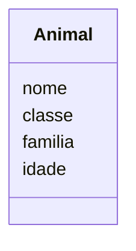
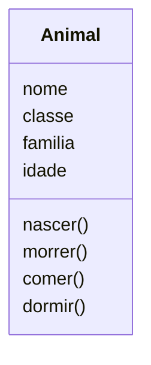
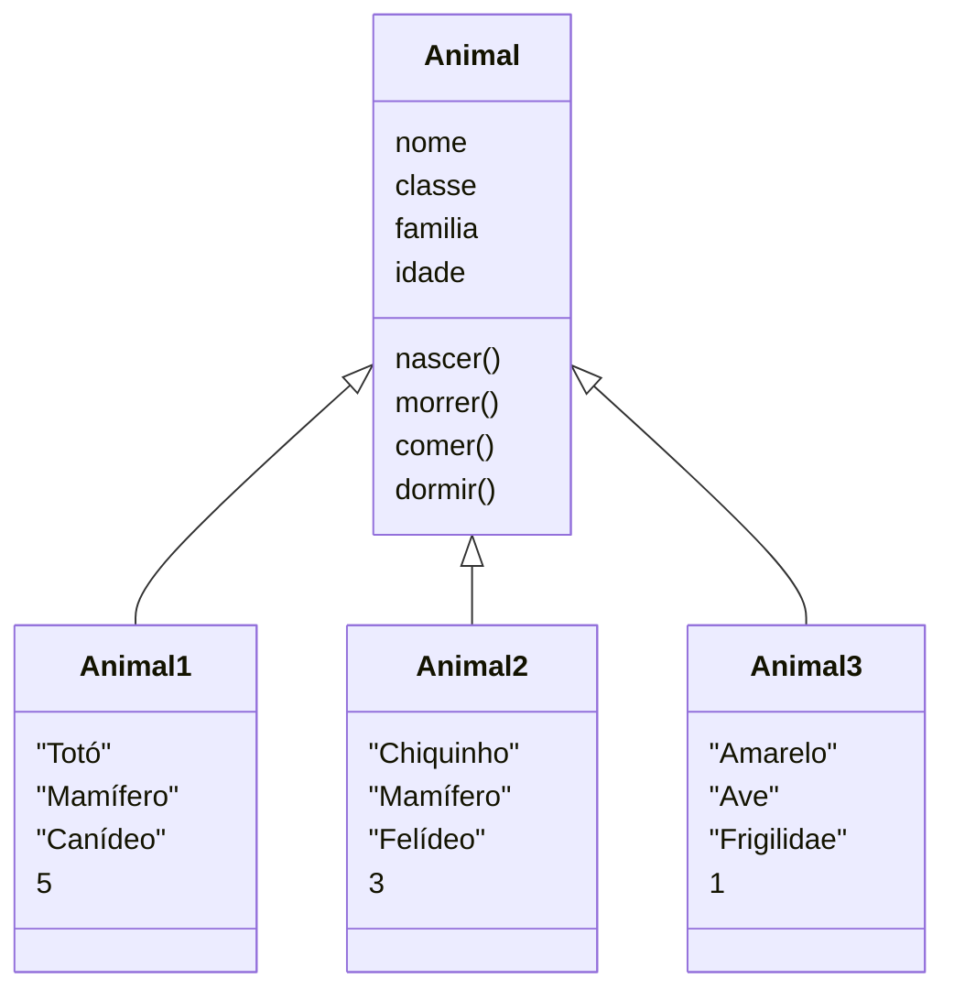
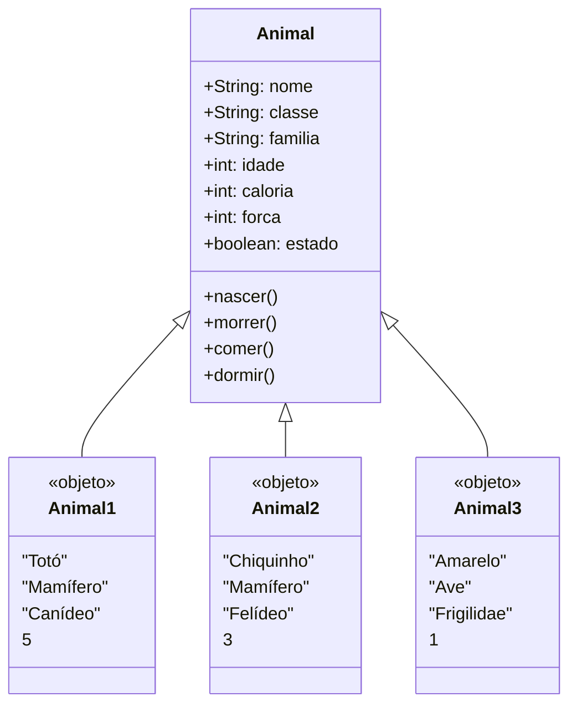

Suponha que você tivesse de criar um jogo de Bicho Virtual (também chamado de Virtual PET ou Tamagotchi). Neste jogo, o jogador terá um animal e deverá fazer com ele várias ações com o objetivo de criá-lo por um determinado tempo. O objetivo é não deixá-lo morrer de fome, cansaço ou sede.

Para construir o jogo usando OO, é preciso imaginar. Imaginar genericamente um animal e não somente um tipo de animal ou apenas o seu animal de estimação.

Pense então nas características principais que gostaria que ele tivesse. Com quais informações você poderia descrever esse animal genérico? Provavelmente seriam: nome, classe, família, idade, cor, tipo de pelagem, cor dos olhos, etc.
Em seguida, determine quais ações seriam executadas por ele. Imagine-se criando situações para o cotidiano desse animal: como nascerá, como morrerá, o que comerá, de que maneira correrá, como dormirá, entre outras situações.

## Diagrama UML de classe

Essas características devem estar presentes na classe e são chamadas de Atributos. Veja o diagrama a seguir que representa a classe Animal, assim como alguns atributos:



Quando se fala em comportamento na definição de classe, está se referindo a métodos, ou seja, às ações/operações.
No Virtual PET foram escolhidas algumas ações, como: nascer, morrer, comer, correr e dormir. Veja no diagrama a seguir como ficam a classe e os objetos com a inserção dos métodos:



## Criando objetos

Todo objeto criado a partir da classe Animal deve ter os atributos descritos no diagrama. Porém, os conteúdos desses atributos presentes nos objetos é que os distinguem entre si. Esses conteúdos são chamados de estados, pois cada objeto criado a partir da classe terá suas características próprias.

Por exemplo: cria 3 objetos a partir da classe animal.

Vamos criar um cachorro, um gato e um passarinho conforme o diagrama:

Diagrama de objetos:



## Implementando

Para implementa com a linguagem de programação precisamos implementar os métodos com suas respectivas funcionalidades:

Os atributos servirão para indicar a saúde do animal. Isto é, ele somente fará algo se estiver vivo (atributo estado), possuir a quantidade de calorias necessárias (atributo caloria) e tiver força para isso (atributo força), como todo animal precisa.

Precisamos especificar os tipos das variáveis para as propriedades da classe animal:

```plaintext
classe ANIMAL
 NOME, CLASSE, FAMILIA: literal
 IDADE,CALORIA,FORCA: numérico
 ESTADO:lógico
```

Os métodos:

- NASCER: método que pergunta os dados do animal: nome, classe e família, coloca-o em estado vivo, insere uma quantidade de calorias e força e insere 0 como estado do atributo idade.
- MORRER: método que coloca o objeto em estado morto.
- COMER: método que, caso o animal não esteja cheio e/ou morto, insere determinada quantidade de calorias e retira uma quantidade de força por ter realizado essa ação.
- CORRER: método que retira determinada quantidade de calorias e uma quantidade de força por ter realizado essa ação, caso o animal não esteja morto ou exausto.
- DORMIR: método que retira determinada quantidade de calorias e insere uma quantidade de força, caso o animal não esteja morto.

Atualizando o diagrama de classe:



### Exemplo em Python

Aqui está a versão do programa em Python, mantendo a estrutura e os métodos fornecida:

```python
class Animal:
 def __init__(self, nome="", classe="", familia="", idade=0, caloria=0, forca=0, estado=False):
 self.nome = nome
 self.classe = classe
 self.familia = familia
 self.idade = idade
 self.caloria = caloria
 self.forca = forca
 self.estado = estado

 def nascer(self, nome, classe, familia, idade, estado, caloria, forca):
 self.nome = nome
 self.classe = classe
 self.familia = familia
 self.idade = idade
 self.estado = estado
 self.caloria = caloria
 self.forca = forca
 print(f"O {nome} nasceu")

 def morrer(self):
 print(f"O {self.nome} morreu")

 def comer(self):
 print(f"O {self.nome} comeu")

 def correr(self):
 print(f"O {self.nome} corre")

 def dormir(self):
 print(f"O {self.nome} dorme")

def main():
 animal1 = Animal(nome="Totó", classe="mamífero", familia="Canídeo", idade=5)
 animal2 = Animal(nome="Chiquinho", classe="mamífero", familia="Felídio", idade=3)
 animal3 = Animal(nome="Amarelo", classe="ave", familia="Fringilidae", idade=1)

 print(f"Nome do animal 1: {animal1.nome}")
 print(f"Classe: {animal1.classe}")
 print(f"Familia: {animal1.familia}")
 print(f"Idade: {animal1.idade}")
 
 print(f"Nome do animal 2: {animal2.nome}")
 print(f"Classe: {animal2.classe}")
 print(f"Familia: {animal2.familia}")
 print(f"Idade: {animal2.idade}")
 
 print(f"Nome do animal 3: {animal3.nome}")
 print(f"Classe: {animal3.classe}")
 print(f"Familia: {animal3.familia}")
 print(f"Idade: {animal3.idade}")

 print("Métodos do animal: ")
 animal1.nascer(animal1.nome, animal1.classe, animal1.familia, animal1.idade, animal1.estado, animal1.caloria, animal1.forca)
 animal3.morrer()
 animal2.correr()
 animal1.comer()

if __name__ == "__main__":
 main()
```

#### Explicação do Código

1. **Classe `Animal`**:
 - Define a estrutura da classe `Animal` com atributos e métodos.
 - O construtor (`__init__`) inicializa os atributos do objeto.
 - Métodos como `nascer`, `morrer`, `comer`, `correr` e `dormir` definem comportamentos para os objetos da classe.

2. **Função `main`**:
 - Cria instâncias da classe `Animal` com diferentes atributos.
 - Imprime informações sobre cada instância.
 - Chama os métodos definidos na classe `Animal`.

3. **Condicional `if __name__ == "__main__"`**:
 - Garante que a função `main` seja executada quando o script for executado diretamente.

## Referências

Xavier, Gley Fabiano Cardoso
Lógica de programação cap. 10. pg. 247.
E-book. Disponível em: [https://bibliotecadigitalsenac.com.br/?from=%3FcontentInfo%3D1306#/legacy/epub/1306](https://bibliotecadigitalsenac.com.br/?from=%3FcontentInfo%3D1306#/legacy/epub/1306)
Acesso em 11/05/2023

- [Editor de diagramas Mermaid](https://mermaid.live/)
- [Mermaid Class diagram Help ](https://mermaid.js.org/syntax/classDiagram.html)
- [Java OOP (Object-Oriented Programming)](https://www.w3schools.com/java/java_oop.asp)
- [Repositório da atividade jogo Pet em Java no Github ](https://github.com/jocile/programador-senac/blob/main/poo/)
