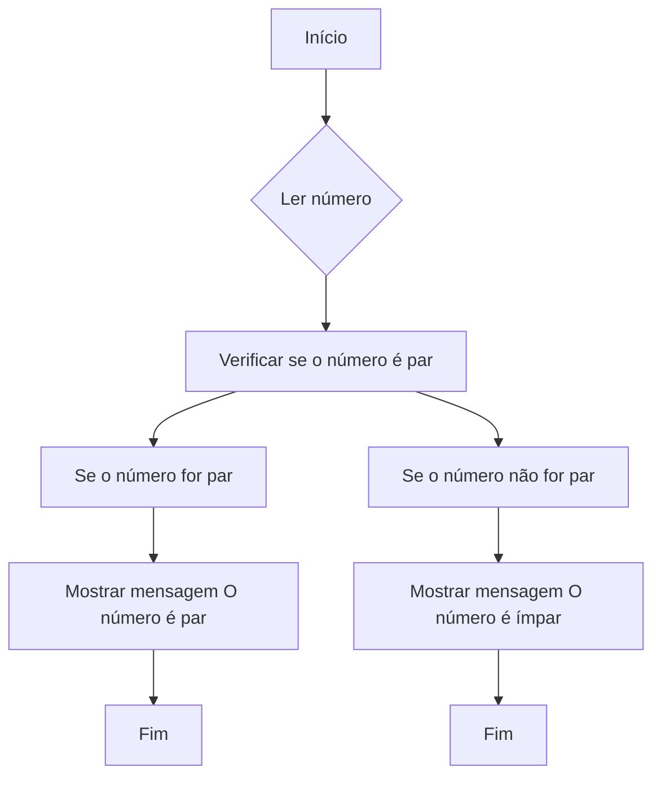
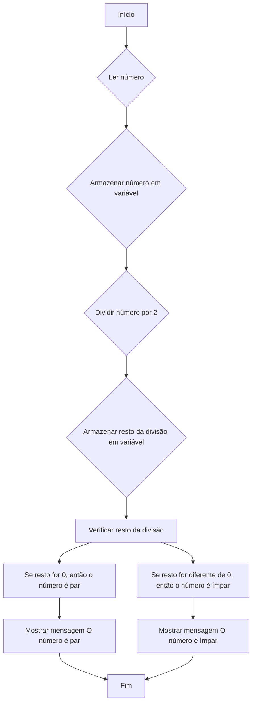
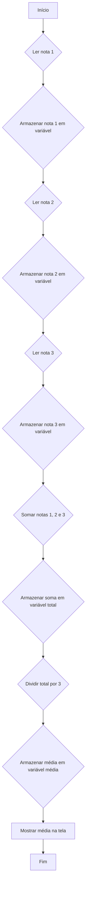

Podemos representar os algoritmos de forma gráfica, para isso utilizamos os fluxogramas.

- Os fluxogramas são formados de caixas com formato variado que conectadas de forma ordenada e lógica informam as instruções a serem executadas. São muito populares por serem de fácil entendi- mento das ideias contidas no algoritmo.
- A representação do fluxograma é ótima para descrever algoritmos de pequeno e médio tamanho.
- **Visualização Clara:** Os fluxogramas transformam a lógica abstrata dos algoritmos em uma linguagem visual compreensível, facilitando o aprendizado e a análise de cada etapa do processo.
- **Comunicação Eficaz:** Funcionam como ferramenta de comunicação entre desenvolvedores, permitindo que diferentes pessoas compreendam a estrutura e o funcionamento do algoritmo de forma clara e objetiva.
- **Identificação de Falhas:** Ao visualizar o algoritmo passo a passo, fica mais fácil identificar erros de lógica, falhas de processamento ou inconsistências na sequência de instruções.
- **Documentação Detalhada:** Os fluxogramas servem como documentação detalhada do algoritmo, registrando todas as etapas e decisões envolvidas no processo.

## Formato

- **Caixas:** Cada caixa representa uma ação específica, como ler um dado, realizar um cálculo ou escrever um resultado. Elas podem ter diferentes formatos e cores para indicar funções distintas.
- **Símbolos:** Os símbolos são os sinais de trânsito do mundo dos fluxogramas. Eles guiam o fluxo da execução do algoritmo, indicando o início, o fim, decisões a serem tomadas e a direção que o processo deve seguir.
- **Linhas de Conexão:** As linhas de conexão são as estradas que ligam as caixas e os símbolos, definindo a ordem em que as instruções devem ser executadas. Elas podem ser contínuas ou segmentadas para indicar diferentes fluxos de execução.
- **Início:** Um símbolo especial marca o início da execução do algoritmo.
- **Comandos e Decisões:** Uma sequência de caixas representa as instruções que o algoritmo deve executar, incluindo cálculos, leituras e decisões a serem tomadas.
- **Bifurcações:** As decisões geram bifurcações no fluxo do algoritmo, direcionando a execução para diferentes caminhos de acordo com o resultado da decisão.
- **Processamento:** As informações são processadas e manipuladas ao longo das etapas do algoritmo.
- **Armazenamento:** Dados e resultados são armazenados em caixas específicas para serem utilizados posteriormente.
- **Fim:** Um símbolo especial marca a finalização da execução do algoritmo

Usando editor de diagramas [mermaid - fluxograma](https://mermaid.js.org/syntax/flowchart.html):

Neste exemplo, podemos observar os diversos símbolos utilizados para representar as diferentes etapas do algoritmo:

- **A:** Símbolo de Início
- **B:** Símbolo de Ação
- **C:** Símbolo de Decisão
- **D, E, G, H:** Símbolos de Ação
- **F, I:** Símbolos de Fim

Ao combiná-los de forma correta, podemos criar fluxogramas que representam a lógica de diversos algoritmos de forma clara e visualmente intuitiva.

## Exemplos

### Verificar se um Número é Par ou Ímpar

Verificar se um Número é Par ou Ímpar: Um fluxograma pode ser utilizado para determinar se um número é par ou ímpar, dividindo-o por dois e verificando o restante da divisão.

**Explicação do Fluxograma:**

1. **Início:** O algoritmo começa com a leitura de um número.
2. **Ler número:** Um número é lido do usuário e armazenado em uma variável.
3. **Armazenar número:** O número lido é armazenado em uma variável chamada `numero`.
4. **Dividir número por 2:** O número armazenado na variável `numero` é dividido por 2 e o resultado é armazenado em uma variável chamada `resto`.
5. **Armazenar resto:** O valor da variável `resto` é armazenado em uma variável chamada `restoDivisao`.
6. **Verificar resto da divisão:** O valor da variável `restoDivisao` é verificado.
7. **Se resto for 0, então o número é par:** Se o valor da variável `restoDivisao` for 0, então o número é par e a mensagem "O número é par" é exibida na tela.
8. **Mostrar mensagem "O número é par":** A mensagem "O número é par" é exibida na tela do usuário.
9. **Fim:** O algoritmo termina.
10. **Se resto for diferente de 0, então o número é ímpar:** Se o valor da variável `restoDivisao` for diferente de 0, então o número é ímpar e a mensagem "O número é ímpar" é exibida na tela.
11. **Mostrar mensagem "O número é ímpar":** A mensagem "O número é ímpar" é exibida na tela do usuário.
12. **Fim:** O algoritmo termina.

### **Calcular a Média de Três Notas** 

Um fluxograma pode ser usado para representar o processo de calcular a média de três notas, mostrando os passos de somar as notas e dividir o resultado por três.

**Explicação do Fluxograma:**

1. **Início:** O algoritmo começa com a leitura da primeira nota.
2. **Ler nota 1:** A nota 1 é lida do usuário e armazenada em uma variável.
3. **Armazenar nota 1:** A nota 1 é armazenada em uma variável chamada `nota1`.
4. **Ler nota 2:** A nota 2 é lida do usuário e armazenada em uma variável.
5. **Armazenar nota 2:** A nota 2 é armazenada em uma variável chamada `nota2`.
6. **Ler nota 3:** A nota 3 é lida do usuário e armazenada em uma variável.
7. **Armazenar nota 3:** A nota 3 é armazenada em uma variável chamada `nota3`.
8. **Somar notas 1, 2 e 3:** As notas 1, 2 e 3 são somadas e o resultado é armazenado em uma variável chamada `total`.
9. **Armazenar soma:** O valor da variável `total` é armazenado em uma variável chamada `soma`.
10. **Dividir total por 3:** O valor da variável `soma` é dividido por 3 e o resultado é armazenado em uma variável chamada `media`.
11. **Armazenar média:** O valor da variável `media` é armazenado em uma variável chamada `média`.
12. **Mostrar média na tela:** A média é exibida na tela do usuário.
13. **Fim:** O algoritmo termina.

[03-introdução-aos-algoritmos ⬅️](03-introdução-aos-algoritmos.md) | [➡️ 05-editor-de-Diagramas-mermaid](05-editor-de-Diagramas-mermaid.md)
