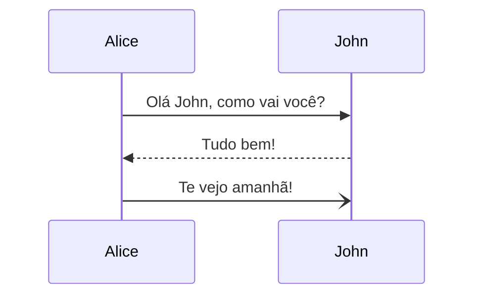
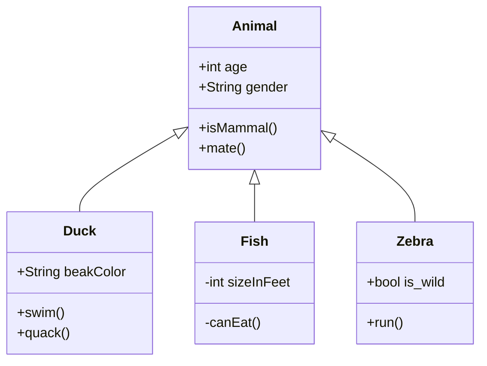
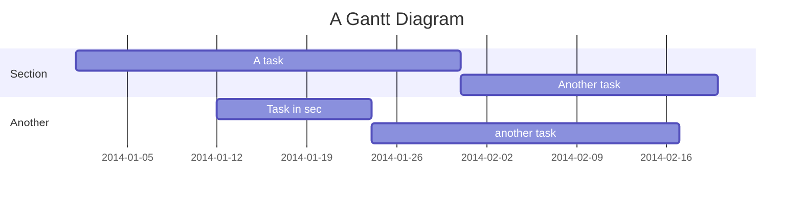

Mermaid não é a criatura mítica do mar, mas sim uma poderosa e versátil ferramenta de diagramação e criação de gráficos. Aqui está um resumo do que ela é:

## **O que é**

- Uma ferramenta baseada em JavaScript que permite criar diversos diagramas e gráficos usando uma sintaxe simples baseada em texto.
- Pense nisso como escrever código para gerar elementos visuais.
- A sintaxe é inspirada no Markdown, tornando-a fácil de aprender e usar, mesmo para aqueles sem experiência prévia em codificação.

## **O que ela pode fazer**

- Criar vários tipos de diagramas, incluindo:
    - Fluxogramas: Visualize o fluxo da lógica em algoritmos ou processos.
    - Diagramas de sequencia: Ilustre a interação entre diferentes partes de um sistema ao longo do tempo.
    - Gráficos de Gantt: Represente cronogramas e agendas de projetos.
    - Mapas de jornada do usuário: Descreva as etapas que os usuários realizam ao interagir com um produto ou serviço.
    - Gráficos de pizza, barras e outras representações gráficas de dados.

## **Principais benefícios**

- Simples e intuitiva: A sintaxe baseada em texto é fácil de aprender e entender, mesmo para iniciantes.
- Versátil: Pode criar uma ampla variedade de diagramas, tornando-a adequada para diversos projetos e necessidades.
- Compatibilidade multiplataforma: Funciona perfeitamente em diferentes sistemas operacionais e pode ser integrada a várias ferramentas e plataformas.
- Código aberto: Gratuito e constantemente sendo aprimorado pela comunidade de desenvolvedores.

> [!NOTA]
> Ao usar o Mermaid, você pode comunicar ideias e processos complexos de forma eficaz por meio de diagramas visualmente atraentes, tornando-o uma ferramenta valiosa para programadores, analistas, designers e qualquer pessoa que precise criar representações visuais claras e concisas.

## Exemplos

### Diagrama de sequência



Veja o código:
```plaintext
sequenceDiagram
Alice->>John: Olá John, como vai você?
John-->>Alice: Tudo bem!
Alice-)John: Te vejo amanhã!
```

### Diagrama de classes



Veja o código:

```plaintext
classDiagram
        Animal <|-- Duck
        Animal <|-- Fish
        Animal <|-- Zebra
        Animal : +int age
        Animal : +String gender
        Animal: +isMammal()
        Animal: +mate()
        class Duck{
            +String beakColor
            +swim()
            +quack()
        }
        class Fish{
            -int sizeInFeet
            -canEat()
        }
        class Zebra{
            +bool is_wild
            +run()
        }
```

### Diagrama de Gantt



Veja o código:


```plaintext
gantt
        title A Gantt Diagram
        dateFormat  YYYY-MM-DD
        section Section
        A task           :a1, 2014-01-01, 30d
        Another task     :after a1  , 20d
        section Another
        Task in sec      :2014-01-12  , 12d
        another task      : 24d
```


## Referências

- Site oficial: [https://mermaid.js.org/](https://mermaid.js.org/)
- Tutorial Mermaid: [https://mermaid.js.org/intro/getting-started.html](https://mermaid.js.org/intro/getting-started.html)
- Editor Online Mermaid: [https://mermaid.live/](https://mermaid.live/)

[04-fluxogramas ⬅️](04-fluxogramas.md) | [➡️ 06-links-de-diagramas](06-links-de-diagramas.md)
