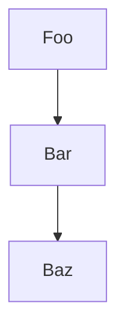

A documentação é essencial para organização e projetos de sistemas, nela podem ser descritos os detalhes e registar as funcionalidades.

## Usando Markdown para Gist e GitHub

O [Markdown](documentacao-com-Markdown.md) é uma linguagem de marcação leve e popular para criar documentação. É fácil de aprender e usar, tornando-o ideal para compartilhar informações em projetos Gist e GitHub. Além disso, o [editor de Diagramas mermaid](05-editor-de-Diagramas-mermaid.md) é uma ferramenta poderosa para criar diagramas dentro da sua documentação, tornando-a ainda mais visual e informativa.

**Criando Documentação Markdown:**

1. **Comece com um Arquivo .md:** Crie um novo arquivo com a extensão `.md`. Este será o seu arquivo de documentação Markdown.
    
2. **Estrutura básica:** Utilize cabeçalhos (`#`, `##`, `###`, etc.) para organizar seu conteúdo em seções e subseções. Utilize parágrafos (`p`) para o corpo do texto e listas (`*`, `-`, `+`) para enumerar itens.
    
3. **Formatação:** Utilize recursos Markdown para formatar seu texto, como **negrito** (`**texto**`), _itálico_ (`_texto_`), `código` (``código`), e links (`texto: link`).
    

**Exemplo de estrutura básica:**

```Markdown
# Título da Documentação

## Introdução

Explique o que é o seu projeto e qual o objetivo da documentação.

## Instalando

Descreva como instalar o seu projeto.

## Uso

Explique como usar o seu projeto, com exemplos.

## Contribuição

Explique como contribuir para o seu projeto.
```

## **Adicionando Diagramas Mermaid:**

1. **Inclua a biblioteca Mermaid:** No início do seu arquivo Markdown, adicione a seguinte linha para incluir a biblioteca Mermaid:

````Markdown

````

2. **Crie diagramas:** Utilize a linguagem Mermaid para criar seus diagramas dentro da documentação. Você pode encontrar mais informações sobre a sintaxe Mermaid em [https://github.com/mermaid-js/mermaid](https://github.com/mermaid-js/mermaid).

**Exemplo de diagrama:**

```mermaid
graph TD
A[Foo] --> B[Bar]
B --> C[Baz]
````

> [!tip] Dicas

- Utilize ferramentas online como [https://mermaid.live/](https://mermaid.live/) para criar e visualizar seus diagramas Mermaid antes de adicioná-los à sua documentação.
- Organize seus diagramas em seções relevantes da sua documentação.
- Utilize legendas e descrições para tornar seus diagramas mais claros e informativos.
- Teste sua documentação em diferentes visualizadores Markdown para garantir que a formatação esteja correta.

## Prática usando o Gist

Vamos praticar a criação de documentação Markdown com diagramas Mermaid usando o Gist:

1. **Acesse o Gist:** Abra o site do Gist em [https://gist.github.com/](https://gist.github.com/).
    
2. **Crie um novo Gist:** Clique no botão "Create gist".
    
3. **Adicione o conteúdo Markdown:** Na caixa de texto principal, insira o seguinte conteúdo:
    
````Markdown
# Diagrama de Fluxo Simples

Este é um exemplo de diagrama de fluxo simples usando Mermaid.

```mermaid
graph LR
A[Inicio] --> B{Verificação}
B --> C{Sim} --> D[Sucesso]
B --> E{Não} --> F[Falha]
````

4. **Adicione um título:** No campo "Description", adicione um título para o seu Gist, por exemplo, "Documentação de Exemplo com Mermaid".
    
5. **Crie o Gist:** Clique no botão "Create public gist".
    

Agora você criou um Gist público contendo documentação Markdown com um diagrama Mermaid simples.

**Vamos explorar o resultado:**

1. Acesse o link do seu Gist recém-criado.
    
2. Observe que o Markdown foi renderizado corretamente, com títulos e parágrafos formatados.
    
3. O diagrama Mermaid também deve estar renderizado e visível na página.
    
**Experimente mais:**

- Modifique o código Mermaid para criar diferentes tipos de diagramas (veja a documentação em [https://mermaid-js.github.io/](https://mermaid-js.github.io/)).
- Adicione mais seções de texto à sua documentação Markdown para explicar o que o diagrama representa.
- Compartilhe o link do seu Gist com outras pessoas para que elas possam visualizar sua documentação.

Através deste exemplo, você praticou a criação de documentação Markdown com diagramas Mermaid em um Gist. Lembre-se de explorar as possibilidades do Mermaid para criar diagramas mais complexos e informativos para seus projetos.

## Referências

- Documentação Markdown do GitHub: [https://docs.github.com/pt/github/writing-on-github/basic-writing-and-formatting-syntax](https://docs.github.com/pt/github/writing-on-github/basic-writing-and-formatting-syntax)
- Documentação Mermaid: [https://mermaid-js.github.io/](https://mermaid-js.github.io/)
- Exemplos de diagramas Mermaid: [editor de Diagramas mermaid](05-editor-de-Diagramas-mermaid.md)

> [!NOTA] 
> Ao seguir estas dicas, você poderá criar documentação Markdown clara, concisa e visualmente atraente para seus projetos Gist e GitHub, utilizando o poder dos diagramas Mermaid.
