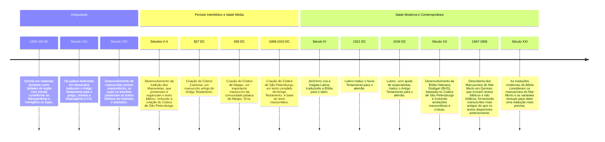

```mermaid
timeline
   
    section Antiguidade
    
    1200-100 AC: Escrita em materiais duráveis como tabletes de argila com escrita cuneiforme na Mesopotâmia e hieróglifos no Egito.
        
    Século I AC: Os judeus helenistas em Alexandria traduzem o Antigo Testamento para o grego, criando a Septuaginta (LXX).
        
    Século I DC: Desenvolvimento de manuscritos protom massoréticos, os quais os escribas preservam os textos bíblicos em hebraico e aramaico.

    
    section Período Interbíblico e Idade Média
         
    Séculos V-X: Desenvolvimento da tradição dos Massoretas, que preservam e organizam o texto bíblico, incluindo a criação do Códice de São Petersburgo.
        
    827 DC: Criação do Códice Cairense, um manuscrito antigo do Antigo Testamento.
        
    930 DC: Criação do Códice de Aleppo, um importante manuscrito da comunidade judaica de Aleppo, Síria.
        
    1008-1010 DC: Criação do Códice de São Petersburgo, um texto completo do Antigo Testamento, e base do texto massorético.
    
    section Idade Moderna e Contemporânea
    
    Século IV: Jerônimo cria a Vulgata Latina, traduzindo a Bíblia para o latim.
        
    1521 DC: Lutero traduz o Novo Testamento para o alemão.
    
    1534 DC: Lutero, com ajuda de especialistas, traduz o Antigo Testamento para o alemão.
    
    Século XX: Desenvolvimento da Bíblia Hebraica Stuttgart (BHS), baseada no Códice de São Petersburgo e incluindo anotações massoréticas e críticas.
   
    1947-1956: Descoberta dos Manuscritos do Mar Morto em Qumran, que incluem textos bíblicos e não bíblicos, fornecendo manuscritos mais antigos do que os textos disponíveis anteriormente.
   
    Século XXI: As traduções modernas da Bíblia consideram os manuscritos do Mar Morto e as variantes textuais para obter uma tradução mais precisa.
```

## Manuscritos Bíblicos

Fonte: [Aula 1 - Manuscritos - Luiz Sayão - IBNU - YouTube](https://www.youtube.com/watch?v=RDCQombCuGw&list=PLl90RweiCeJyH1CCf8Hy2rLfQ_MhUUIjP&index=1)
