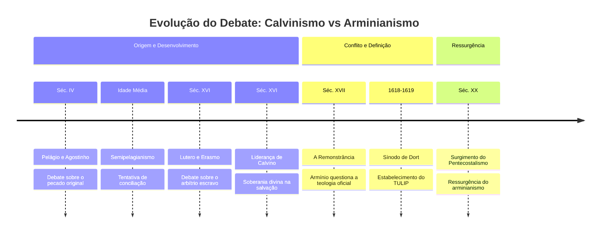

## Cabeçalho editorial

- **Tema:** Evolução histórica do debate teológico sobre livre-arbítrio e salvação  ·  **Audiência:** Geral/Teológica
- **Período:** Século IV — Século XX  ·  **7 marcos selecionados**

>[!abstract]  O debate, que se estende dos Pais da Igreja até a atualidade, reflete a tensão contínua entre a soberania divina e a responsabilidade humana na soteriologia.

### Tabela

| # | 🏷️ | Data | Título | Descrição | Fase |
|--:|-----|------|--------|-----------|------|
| 1 | 📜 | Séc. IV | Pelágio e Agostinho | Embate inicial sobre o pecado original e livre-arbítrio. | Origem |
| 2 | ⛪ | Idade Média | Semipelagianismo | Tentativa católica de conciliar as visões sem sucesso. | Desenvolvimento |
| 3 | 🖋️ | Séc. XVI | Lutero e Erasmo | Debate intenso na Reforma sobre o arbítrio escravo. | Desenvolvimento |
| 4 | 💡 | Séc. XVI | Liderança de Calvino | Consolidação da ênfase na soberania divina na salvação. | Desenvolvimento |
| 5 | ⚠️ | Séc. XVII | A Remonstrância | Armínio e discípulos questionam a teologia calvinista oficial. | Conflito |
| 6 | ⚖️ | 1618-1619 | Sínodo de Dort | Rejeição do remonstrantismo e estabelecimento do TULIP. ⭐ | Conclusão |
| 7 | 🚀 | Séc. XX | Surgimento do Pentecostalismo | Ressurgência do arminianismo no cenário evangélico global. | Ressurgência |

### Diagrama

>[!cite] Referência: [Vídeo de Augustus Nicodemus sobre as DIFERENÇAS DO CALVINISMO E ARMINIANISMO](https://www.youtube.com/watch?v=GT3yqsa__3g)
