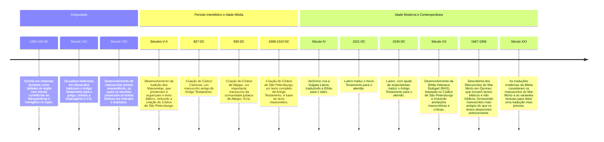

## Manuscritos Bíblicos

Fonte: [Aula 1 - Manuscritos - Luiz Sayão - IBNU - YouTube](https://www.youtube.com/watch?v=RDCQombCuGw&list=PLl90RweiCeJyH1CCf8Hy2rLfQ_MhUUIjP&index=1)

%%

# Excalidraw Data

## Text Elements

## Drawing
```compressed-json
N4KAkARALgngDgUwgLgAQQQDwMYEMA2AlgCYBOuA7hADTgQBuCpAzoQPYB2KqATLZMzYBXUtiRoIACyhQ4zZAHoFAc0JRJQgEYA6bGwC2CgF7N6hbEcK4OCtptbErHALRY8RMpWdx8Q1TdIEfARcZgRmBShcZQUebR4ANm0AFho6IIR9BA4oZm4AbXAwUDBSiBJuCABGAHZ8AE0AGQB5Zh5GuAAtAA4ABgBVADMADQARfQBhACUYNNLIWERKwn1o

pH4yzG5nKt6aqu1e5JqAVirumoBmZIBOG4SEjchZtGceW+0bqt2LmqPuy48E7JJ4QCgkdTcHhVZJxXo3E69S41ZIJO43S6XUGSBCEZTSbi3G7abo8aGnZLwh5nUHWZTBbi9UHMKCkNgAawQEzY+DYpEqrOszDguECOTmZU0uGw7OUbKEHGI3N5/Ikgo4wtF2SgEsgg0I+HwAGVYAyJIIPLqICy2ZyAOoQyRQ5msjkIE0wM3oC0VUHy/EccJ5NBVU

FsEXYNQvVC7JlFSBy4RwACSxGDqHyAF1QYNyFlU9wOEJDaDCIqsJVcL0rfLFYHmOmiyX49aEAhiISbslkpcEjUHqDGCx2Fw0CCW0PWJwAHKcMTcKo3faXM69vgtwjMUYZKDt7iDAhhUGaYSKgCiwSyOXTWdBQjgxFwu47IauJwB1xOCR4e1BRA47KFsW+B/mwMp7mgB74EeLbYEILIGKMT64NwJTzBAWSkKsJAACpYDqaorEEZYIAAOhwqCUeRlG

UWE2BQCOqAAII5HiQgkLgxBkRRNHUTRVQ/r0Oy9L0zETGgZ7MNgpBqLgqCZKgqy7jJuCbqgxAiAAh4wal6PobCoFEmjBLuzDqQgqCiqo+ByXp8lSTJUSoHBgaEIMfJZKgHByQAsuE4ZsFAABH+hWPJqCSIQTAAM/0m5bBmRwBlnqoUBsNofE0bxPGUUaACXcG8qgyZiWgrSoAAVkIXHwRFGQcJuURmQpTHBJg1hkGFgoaUYCkGSxDHKAZeEsrgV5

pagIrkKgBlyggQ3UM5KmKgZclGggcBQEI0Rlk5AAUjTDMMACUGU5VlqCZag+WFQZJWjOJqDbmEHD0DyZjjQZXGKdY8HSWoCWTWyaX6D9DZ8nlDF6Mwi2AwAjttamA+E/1SmZcCBGEpD0GNM1mbumBpWZmgALfGeYyOgzimjkBT4WimNql6GdV1XXRDGcKgAAKTAk2wxB3TkTCk+TejhamnEWT5eWOLgV0XVdN3FoDABqzjDGgz3ZG9+AfdqX1yd1

hAAOcAMdfYDPmhIIgRNYtCMWRj4RMDjoMWXyyjWIQRi4wZBMTSLRB6ItZbYL4ZYC5ZS1WGbFuoBM0WOGI5nXeb3MIMpzCaCIQ1nRd2VZaSNRPY9EwqbH6kGQnScWRMqlikeqBCKDqxFg5AOWaxQ2V8xXfDeEUSfXn+eXedGKiQ9aBlzHaeR9X5gWd9rUbXAbCLc3qArKvpBRELP1t/9E2Ps5BgKhx31VY+5hyUvwRwKvi1GiTKnD/nV2xt0wm7CX

U/l7PVeJwXinI0aceaZ2zqQBaTdQb+wMnpHwGc44DTxP3Uan1FoWTRovP2+EDKrHBqQSGFNX6jyyuzRiEtvo+X5kwby4VuRC30NvIKgY5bnUVgVZWxUVZoAAFJMAAC8NX0tHOSckVbFk9k5RoT4yy4EWt1IQlgVpRwAEJkyIHJKackDI2QYvoEhWV34nGhD/VAjQhDKT9uQHqM1UCzjeqgEag99aTQZnYggmRzYkOMdcMxFirGLTsrgS+N8LLhEQ

JGAgjVQgKJsUouxyDu7OLGq47RHjLzeNZudJWRUjqa2dq9d6REcgG1QOo8mckAASCAaZMzWltGQnsd6oD2qoqpRpjqLSwZxOSSV46AOTt9EBBkwFMCzjnAyFlQ7hxUdYQKuBjYAFfwhgxtkQvAzUlokyhqEV+78uw1B2AiBIBSpJ2CYE5AWZkrYH0coDSOVtSCoGoTvKZoMACKzdyAcHtkIaZHAw7/Jgbg4mGiKZbI4GnQOELFruVIIGMQKjW5/X

uWZbCZlrCDQeQZB2eNDKgvUpuVeHASY6UxULGSHltQIH2TkzheThjJjQExfG8TlmrP0lxBFoR1JyQqZok+GoSBMF9ui367ciY9yeS8vkE0LK8pxstUyBLCaI3Ru4uwyloGG3ZWnDFQMECRmYLgbQEB4wAF8XRPngpUE1jAOw5gNAgAsEhejYBZD5BIhAVZVA+UYGoPBhgTAoH5fQCQjRWikp4go8YwChjjVUeM2ZYJsjgEBZs6FJChDwoTRoZZAK

QUPAgIoFrwApsgLge+JonziFQGhaAOIsiVCIPiHUGwGBRQoKo6UspaxKh5HySoABiQYY7x0SggHBUgYooDJl3PoE0touSDtVOgYdVQECbs3ZO6ds752ZB7TKRMCoB0qgFD8zUs7d0iH3QugAYgaY0po63Wh5L6IoU7b3agPYu109pHQAGkEDRggCefAjrP17p/QupdboVaiisJoA0UZKh6A1LvdtUHv05F/XBzkHovRvstB26DuGF1TGEAGIMC5S

M4bnQu5oEZUMhhEnRmdMHMj3s4FAe9Y0DTRgTWUMjDGuM8aNN7OtP52N3syLmqArU8SjnQMEQYWHhP0bw1EHeTEZ1sAoDiTiGaQLYY4+RzIZ5FS6bZAZkIL50Cihszeszon9DWf0zheAr7+3Odk/oe9eYECUa9E2EzZQHI8nwMMBc8ITgkkRCcdEVRAQJBOFiT9EXDT1G4H8Xo2gEjfH2IiHglwBJfA7UYNgBhUITgIP8xk+WEiUnuKWmTnH9CUd

PfWdMEAfMdrlCQCTvUoRxjKAN4gJoNrcBOP1mSxBqFcUs7gYyEFUBQRgmNubyoh1oDQpAVRPJ7O9eUFKPa5JFrnd4LURaeWTjHStFMeaxZRSVEgadkrTJeCXE+x9m72g7vmtKFa0zs78MICYxzDUxmO25lSY98sMkODKBq+hbIy3gj2dZP80EYdCDprQFjhAoJvLNoJ6QbHLZhBQH/HWwnoJVikE5KQacqTuB05bAzpnS2VuY/JyWoHHa7AVSNbk

I03k4ALYQNzjH+5i0dulAxRgOEqv4BR2URYr6wjBHoiOK0cEEL6E80sNAoXQLgXs+tonLZcwGHWtryHsvoJW/QjZFkTEddK5V8Z1rn7HAmpWww/2fkiyO425AZDioyzKC5oEQYTBsjzgkGjnnk7NyqIjlH6Xq32dlE3D5Egq9dpi6rXATP3kU9k4p5KNgmA7ci5HJLtDPHVJcHAMDvUzr0zADLRaoAA=
```
%%