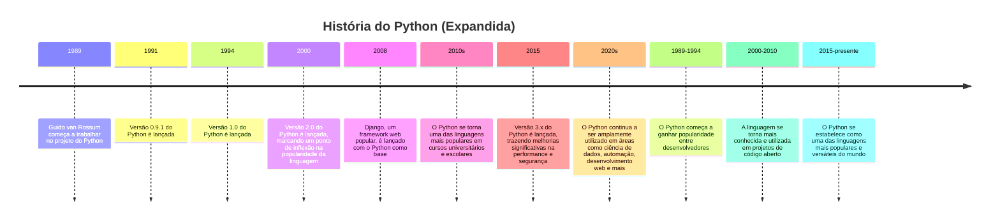

---
tags:
- Python
description: "Linguagem de programação avançada usada em inteligência artificial e automação"
--- 

A linguagem de programação [Linguagem Python](Linguagem%20Python.md) foi criada por Guido van Rossum, um desenvolvedor de software neerlandês, em meados da década de 1990. Na época, Van Rossum era um engenheiro de sistemas do Laboratório Nacional Holandês (Netherlands National Laboratory) e estava procurando uma linguagem de programação mais fácil de aprender e mais flexível para uso em seus projetos.

Em 1989, Van Rossum começou a trabalhar no projeto de uma linguagem de programação que seria "engraçada" e "fácil de aprender", inspirado pelas linguagens de programação ABC (ABC: A Better Card Game) e Modula-2. Ele escolheu o nome "Python" porque era um animal exótico e agradável, que ele achava adequado para uma linguagem de programação "amigável".

A versão 0.9.1 do Python foi lançada em fevereiro de 1991, seguida pela versão 1.0 em janeiro de 1994. Na época, o Python era apenas uma linguagem de programação para desenvolvedores e não havia muito uso empresarial ou acadêmico.

No entanto, a partir da versão 2.0 (lançada em 2000), o Python começou a ganhar popularidade graças ao seu poder de crescimento rápido e sua facilidade de aprendizado. A comunidade do Python começou a crescer rapidamente e a linguagem se tornou uma das mais usadas no mundo.

Hoje, o Python é amplamente utilizado em áreas como:

1. Ciência de dados: análise estatística, [Machine Learning](Machine%20Learning.md), visualização de dados.
2. Automação: scripts para automatizar tarefas, integração com outros sistemas.
3. Desenvolvimento web: frameworks como [Django](Django.md) e Flask.
4. Robótica e Internet das Coisas (IoT).
5. Ciência computacional: simulações, modelagem, análise de dados.

O Python é também uma linguagem muito popular em cursos universitários e escolares, pois sua facilidade de aprendizado e a ampla variedade de aplicação fazem com que seja uma ótima opção para iniciantes.

Em resumo, a história do Python é um exemplo de como uma ideia simples e inspirada pode evoluir e se tornar uma linguagem de programação poderosa e versátil, utilizada em uma ampla variedade de áreas.

## Timeline

