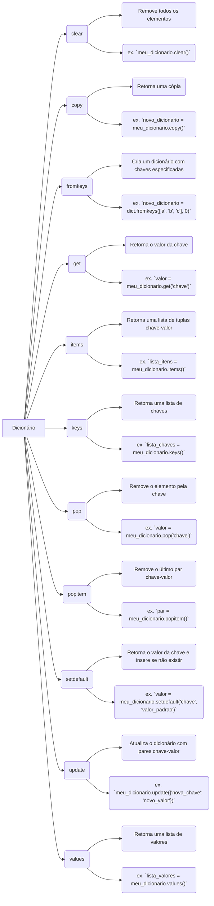

Aqui está um diagrama Mermaid com as descrições das principais funções de dicionários em Python:

```mermaid

flowchart LR
A[Dicionário] --> B(clear)
B --> B1(Remove todos os elementos)
B --> B2("ex. `meu_dicionario.clear()`")
A --> C(copy)
C --> C1(Retorna uma cópia)
C --> C2("ex. `novo_dicionario = meu_dicionario.copy()`")
A --> D(fromkeys)
D --> D1(Cria um dicionário com chaves especificadas)
D --> D2("ex. `novo_dicionario = dict.fromkeys(['a', 'b', 'c'], 0)`")
A --> E(get)
E --> E1(Retorna o valor da chave)
E --> E2("ex. `valor = meu_dicionario.get('chave')`")
A --> F(items)
F --> F1(Retorna uma lista de tuplas chave-valor)
F --> F2("ex. `lista_itens = meu_dicionario.items()`")
A --> G(keys)
G --> G1(Retorna uma lista de chaves)
G --> G2("ex. `lista_chaves = meu_dicionario.keys()`")
A --> H(pop)
H --> H1(Remove o elemento pela chave)
H --> H2("ex. `valor = meu_dicionario.pop('chave')`")
A --> I(popitem)
I --> I1(Remove o último par chave-valor)
I --> I2("ex. `par = meu_dicionario.popitem()`")
A --> J(setdefault)
J --> J1(Retorna o valor da chave e insere se não existir)
J --> J2("ex. `valor = meu_dicionario.setdefault('chave', 'valor_padrao')`")
A --> K(update)
K --> K1(Atualiza o dicionário com pares chave-valor)
K --> K2("ex. `meu_dicionario.update({'nova_chave': 'novo_valor'})`")
A --> L(values)
L --> L1(Retorna uma lista de valores)
L --> L2("ex. `lista_valores = meu_dicionario.values()`")
```
