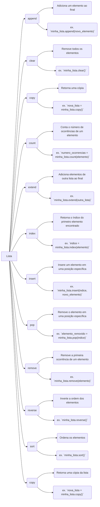

**Explicação do diagrama:**

O diagrama Mermaid acima ilustra as principais funções das listas em Python. Cada função é representada por um nó no diagrama, e as setas indicam a relação entre as funções.

**Funções:**

- **append:** Adiciona um elemento ao final da lista.
- **clear:** Remove todos os elementos da lista.
- **copy:** Retorna uma cópia da lista.
- **count:** Conta o número de ocorrências de um elemento na lista.
- **extend:** Adiciona elementos de outra lista ao final da lista.
- **index:** Retorna o índice do primeiro elemento encontrado na lista.
- **insert:** Insere um elemento em uma posição específica da lista.
- **pop:** Remove o elemento em uma posição específica da lista.
- **remove:** Remove a primeira ocorrência de um elemento da lista.
- **reverse:** Inverte a ordem dos elementos da lista.
- **sort:** Ordena os elementos da lista.

**Exemplos:**

O diagrama também inclui exemplos de como usar cada função. Por exemplo, o exemplo para a função `append` mostra como adicionar o elemento `novo_elemento` ao final da lista `minha_lista`.

#programador/projetos/diagramas #programador/Python/estruturas
