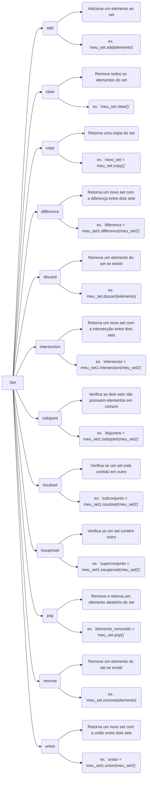

## **Explicação do diagrama:**

O diagrama Mermaid acima ilustra as principais funções dos sets em Python. Cada função é representada por um nó no diagrama, e as setas indicam a relação entre as funções.

**Funções:**

- **add:** Adiciona um elemento ao set.
- **clear:** Remove todos os elementos do set.
- **copy:** Retorna uma cópia do set.
- **difference:** Retorna um novo set com a diferença entre dois sets.
- **discard:** Remove um elemento do set se existir.
- **intersection:** Retorna um novo set com a intersecção entre dois sets.
- **isdisjoint:** Verifica se dois sets não possuem elementos em comum.
- **issubset:** Verifica se um set está contido em outro.
- **issuperset:** Verifica se um set contém outro.
- **pop:** Remove e retorna um elemento aleatório do set.
- **remove:** Remove um elemento do set se existir.
- **union:** Retorna um novo set com a união entre dois sets.

## **Exemplos:**

O diagrama também inclui exemplos de como usar cada função. Por exemplo, o exemplo para a função `add` mostra como adicionar o elemento `elemento` ao set `meu_set`.

**Observações:**

- Este diagrama é apenas uma visão geral das principais funções dos sets em Python. Existem muitas outras funções disponíveis, e cada função tem suas próprias nuances e detalhes.
- Para mais informações sobre as funções de set em Python, consulte a documentação oficial do Python: [https://docs.python.org/3/library/functions.html](https://docs.python.org/3/library/functions.html)
