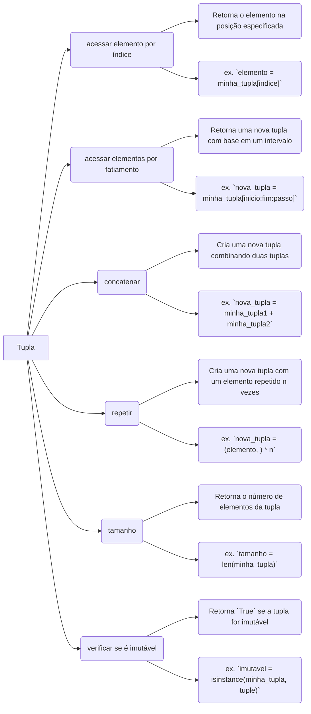

## **Explicação do diagrama:**

O diagrama Mermaid acima ilustra as principais operações de tuplas em Python. Cada operação é representada por um nó no diagrama, e as setas indicam a relação entre as operações.

**Operações:**

- **Acessar elemento por índice:** Retorna o elemento na posição especificada da tupla.
- **Acessar elementos por fatiamento:** Retorna uma nova tupla com base em um intervalo de índices.
- **Concatenar:** Cria uma nova tupla combinando duas tuplas.
- **Repetir:** Cria uma nova tupla com um elemento repetido um número específico de vezes.
- **Tamanho:** Retorna o número de elementos da tupla.
- **Verificar se é imutável:** Retorna `True` se a tupla for imutável.

**Exemplos:**

O diagrama também inclui exemplos de como usar cada operação. Por exemplo, o exemplo para a operação "Acessar elemento por índice" mostra como obter o elemento na posição `0` da tupla `minha_tupla`.

**Observações:**

- Este diagrama é apenas uma visão geral das principais operações de tuplas em Python. Existem outras operações disponíveis, e cada operação tem suas próprias nuances e detalhes.
