Aqui está a tabela comparativa dos métodos de manipulação de strings em Python:

| Método       | Descrição                                                     | Exemplo                                                                                     |
|--------------|---------------------------------------------------------------|---------------------------------------------------------------------------------------------|
| len()        | Retorna o tamanho da string.                                  | `len("Olá, Mundo!") == 11`                                                                  |
| upper()      | Converte todos os caracteres para maiúsculas.                 | `"olá, mundo".upper() == "OLÁ, MUNDO"`                                                      |
| lower()      | Converte todos os caracteres para minúsculas.                 | `"OLÁ, MUNDO".lower() == "olá, mundo"`                                                      |
| strip()      | Remove espaços em branco nas extremidades da string.          | `" Olá, Mundo ".strip() == "Olá, Mundo"`                                                    |
| replace()    | Substitui caracteres na string.                               | `"Olá, Mundo".replace("o", "a") == "Alá, Mundo"`                                             |
| split()      | Divide a string em uma lista de substrings.                   | `"Olá, Mundo".split(", ") == ["Olá", "Mundo!"]`                                             |
| join()       | Une substrings em uma nova string.                            | `", ".join(["Olá", "Mundo!"]) == "Olá, Mundo!"`                                            |
| find()       | Encontra a primeira ocorrência de uma substring.              | `"Olá, Mundo".find("Mundo") == 5`                                                            |
| isupper()    | Verifica se todos os caracteres são maiúsculas.               | `"OLÁ, MUNDO".isupper() == True`                                                            |
| islower()    | Verifica se todos os caracteres são minúsculas.               | `"olá, mundo".islower() == True`                                                            |
| startswith() | Verifica se a string começa com uma substring.                | `"Olá, Mundo".startswith("Olá") == True`                                                     |
| endswith()   | Verifica se a string termina com uma substring.               | `"Olá, Mundo".endswith("Mundo!") == True`                                                    |
| isalnum()    | Verifica se a string contém apenas letras e números.          | `"Olá123".isalnum() == True`                                                                 |
| isspace()    | Verifica se a string contém apenas espaços em branco.         | `" ".isspace() == True`                                                                      |

Essa tabela abrange uma variedade de métodos de manipulação de strings em Python, fornecendo uma descrição concisa e exemplos de uso para cada método.

Aqui está o diagrama refatorado com as funções de strings em Python:

```mermaid
flowchart LR 
A[String] --> B(len)
B --> B1[Retorna o tamanho da string]
B --> B2["ex. `len(#quot;Olá, Mundo!#quot;) == 11`"]
A --> C(upper)
C --> C1[Converte todos os caracteres para maiúsculas]
C --> C2["ex. `#quot;olá, mundo#quot;.upper() == #quot;OLÁ, MUNDO#quot;`"]
A --> D(lower)
D --> D1[Converte todos os caracteres para minúsculas]
D --> D2["ex. `#quot;OLÁ, MUNDO#quot;.lower() == #quot;olá, mundo#quot;`"]
A --> E(strip)
E --> E1[Remove espaços em branco nas extremidades da string]
E --> E2["ex. `#quot; Olá, Mundo #quot;.strip() == #quot;Olá, Mundo#quot;`"]
A --> F(replace)
F --> F1[Substitui caracteres na string]
F --> F2["ex. `#quot;Olá, Mundo#quot;.replace(#quot;o#quot;, #quot;a#quot;) == #quot;Olá, Mundo#quot;`"]
A --> G(split)
G --> G1[Divide a string em uma lista de substrings]
G --> G2["ex. `#quot;Olá, Mundo#quot;.split(#quot;, #quot;) == [#quot;Olá#quot;, #quot;Mundo!#quot;]`"]
A --> H(join)
H --> H1[Une substrings em uma nova string]
H --> H2["ex. `#quot;,#quot;.join([#quot;Olá#quot;, #quot;Mundo!#quot;]) == #quot;Olá, Mundo#quot;`"]
A --> I(find)
I --> I1[Encontra a primeira ocorrência de uma substring]
I --> I2["ex. `#quot;Olá, Mundo#quot;.find(#quot;Mundo#quot;) == 5`"]
A --> J(isupper)
J --> J1[Verifica se todos os caracteres são maiúsculas]
J --> J2["ex. `#quot;OLÁ, MUNDO#quot;.isupper() == True`"]
A --> K(islower)
K --> K1[Verifica se todos os caracteres são minúsculas]
K --> K2["ex. `#quot;olá, mundo#quot;.islower() == True`"]
A --> L(startswith)
L --> L1[Verifica se a string começa com uma substring]
L --> L2["ex. `#quot;Olá, Mundo#quot;.startswith(#quot;Olá#quot;) == True`"]
A --> M(endswith)
M --> M1[Verifica se a string termina com uma substring]
M --> M2["ex. `#quot;Olá, Mundo#quot;.endswith(#quot;Mundo!#quot;) == True`"]
A --> N(isalnum)
N --> N1[Verifica se a string contém apenas letras e números]
N --> N2["ex. `#quot;Olá123#quot;.isalnum() == True`"]
A --> O(isspace)
O --> O1[Verifica se a string contém apenas espaços em branco]
O --> O2["ex. `#quot; #quot;.isspace() == True`"]
```

Este diagrama apresenta as funções básicas e avançadas de strings em Python, incluindo `len`, `upper`, `lower`, `strip`, `replace`, `split`, `join`, `find`, `isupper`, `islower`, `startswith`, `endswith`, `isalnum`, e `isspace`.

