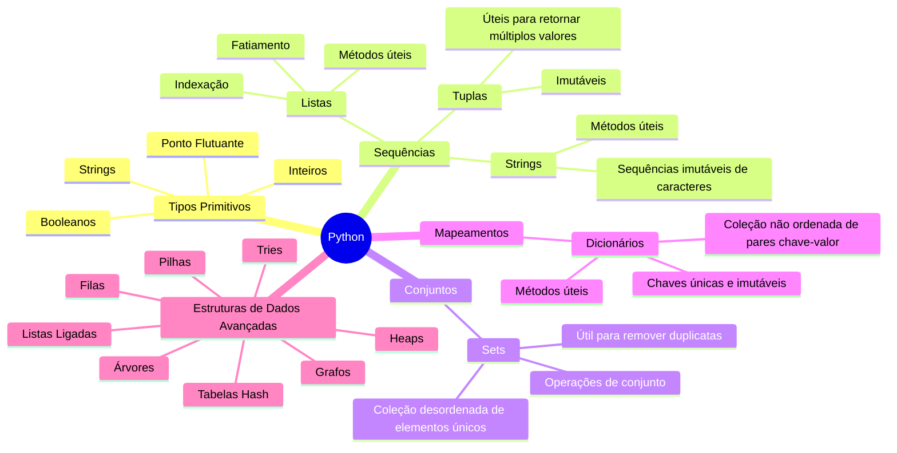

Esse mapa mental organiza de forma hierárquica e visual as principais estruturas de dados em Python, facilitando a compreensão e a visualização das relações entre elas.

```mermaid
mindmap
    root((Python))
        Tipos Primitivos
            Inteiros
            Ponto Flutuante
            Booleanos
            Strings
        Sequências
            Listas
                Indexação
                Fatiamento
                Métodos úteis
            Tuplas
                Imutáveis
                Úteis para retornar múltiplos valores
            Strings
                Sequências imutáveis de caracteres
                Métodos úteis
        Conjuntos
            Sets
                Coleção desordenada de elementos únicos
                Útil para remover duplicatas
                Operações de conjunto
        Mapeamentos
            Dicionários
                Coleção não ordenada de pares chave-valor
                Chaves únicas e imutáveis
                Métodos úteis
        Estruturas de Dados Avançadas
            Listas Ligadas
            Pilhas
            Filas
            Árvores
            Grafos
            Tabelas Hash
            Heaps
            Tries
```
