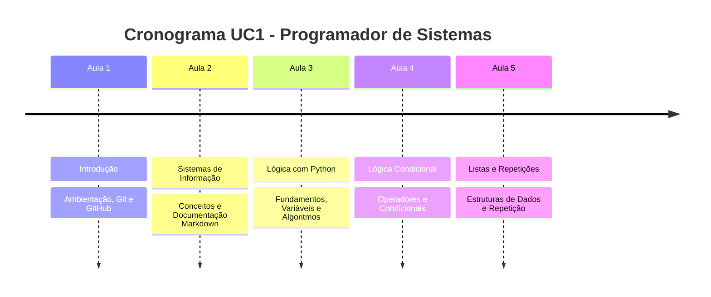

## Tabela de Aulas

| Aula | Tema | Descrição |
| :--- | :--- | :--- |
| 1 | Introdução | Ambientação da turma e introdução ao Git/GitHub. |
| 2 | Sistemas de Informação | Conceitos, tipos de sistemas e documentação em Markdown. |
| 3 | Lógica com Python | Fundamentos, variáveis, tipos de dados e primeiro algoritmo. |
| 4 | Lógica Condicional | Operadores aritméticos, lógicos e estruturas condicionais. |
| 5 | Listas e Repetições | Organização de dados com listas e estruturas de repetição. |

## Diagrama de Linha do Tempo

