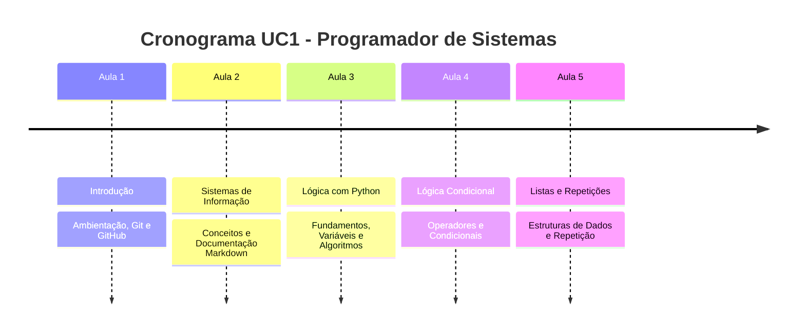
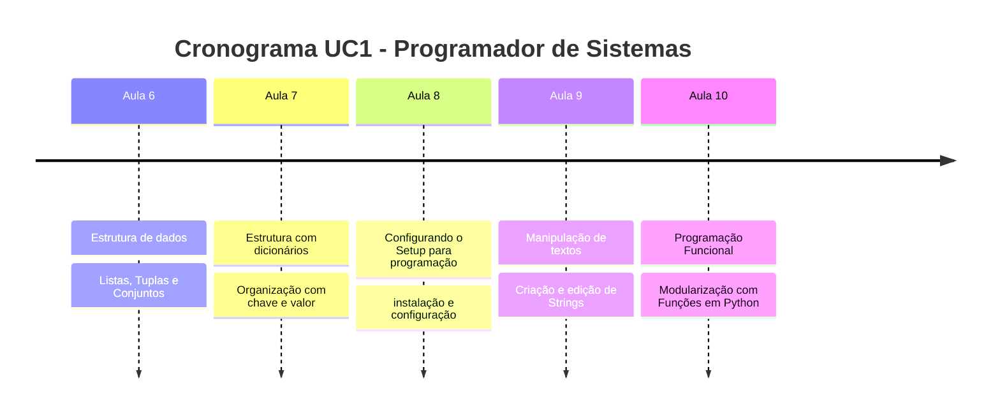
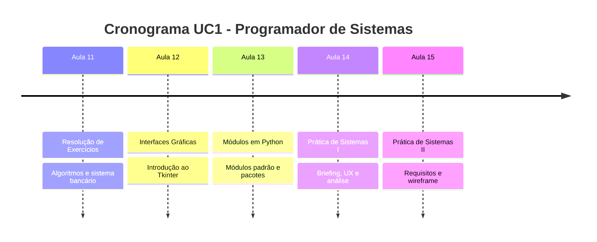

## Tabela de Aulas

| Aula | Tema | Descrição |
| :--- | :--- | :--- |
| 1 | Introdução | Ambientação da turma e introdução ao Git/GitHub. |
| 2 | Sistemas de Informação | Conceitos, tipos de sistemas e documentação em Markdown. |
| 3 | Lógica com Python | Fundamentos, variáveis, tipos de dados e primeiro algoritmo. |
| 4 | Lógica Condicional | Operadores aritméticos, lógicos e estruturas condicionais. |
| 5 | Listas e Repetições | Organização de dados com listas e estruturas de repetição. |
| 6 | Estrutura de dados | Listas, Tuplas e Conjuntos. |
| 7 | Estrutura com dicionários | Organização com chave e valor. |
| 8 | Configurando o Setup | Instalação e configuração do ambiente. |
| 9 | Manipulação de textos | Criação e edição de Strings. |
| 10 | Programação Funcional | Modularização com Funções em Python. |
| 11 | Resolução de Exercícios | Prática de algoritmos e sistema bancário. |
| 12 | Interfaces Gráficas | Introdução ao Tkinter para interfaces. |
| 13 | Módulos em Python | Utilização de módulos padrão e pacotes. |
| 14 | Prática de Sistemas I | Briefing, UX e análise de sistemas. |
| 15 | Prática de Sistemas II | Requisitos, wireframe e projeto. |

## Diagrama de Linha do Tempo

### Primeira semana

```mermaid
timeline
    title Cronograma UC1 - Programador de Sistemas
    Aula 1 : Introdução : Ambientação, Git e GitHub
    Aula 2 : Sistemas de Informação : Conceitos e Documentação Markdown
    Aula 3 : Lógica com Python : Fundamentos, Variáveis e Algoritmos
    Aula 4 : Lógica Condicional : Operadores e Condicionais
    Aula 5 : Listas e Repetições : Estruturas de Dados e Repetição
```

### Segunda semana

```mermaid
timeline
    title Cronograma UC1 - Programador de Sistemas
    Aula 6 : Estrutura de dados : Listas, Tuplas e Conjuntos
    Aula 7 : Estrutura com dicionários : Organização com chave e valor
    Aula 8 : Configurando o Setup para programação : instalação e configuração
    Aula 9 : Manipulação de textos : Criação e edição de Strings
    Aula 10 : Programação Funcional : Modularização com Funções em Python
```

### Terceira semana

```mermaid
timeline
    title Cronograma UC1 - Programador de Sistemas
    Aula 11 : Resolução de Exercícios : Algoritmos e sistema bancário
    Aula 12 : Interfaces Gráficas : Introdução ao Tkinter
    Aula 13 : Módulos em Python : Módulos padrão e pacotes
    Aula 14 : Prática de Sistemas I : Briefing, UX e análise
    Aula 15 : Prática de Sistemas II : Requisitos e wireframe
```
