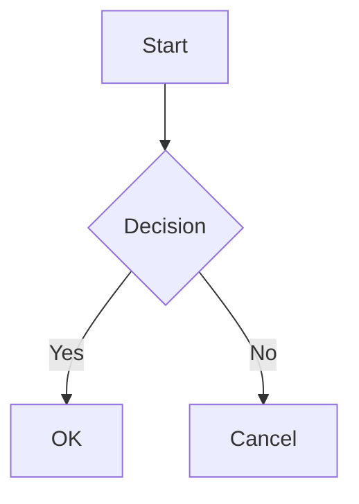

Quartz was originally designed as a tool to publish Obsidian vaults as websites. Even as the scope of Quartz has widened over time, it hasn't lost the ability to seamlessly interoperate with Obsidian.

By default, Quartz ships with the [[ObsidianFlavoredMarkdown]] plugin, which is a transformer plugin that adds support for [Obsidian Flavored Markdown](https://help.obsidian.md/Editing+and+formatting/Obsidian+Flavored+Markdown). This includes support for features like [[wikilinks]] and [[Mermaid diagrams]].

It also ships with support for [frontmatter parsing](https://help.obsidian.md/Editing+and+formatting/Properties) with the same fields that Obsidian uses through the [[Frontmatter]] transformer plugin.

Finally, Quartz also provides [[CrawlLinks]] plugin, which allows you to customize Quartz's link resolution behaviour to match Obsidian.

## Supported Features

### Wikilinks

Internal links using the `[[page]]` syntax are converted to regular links. See [[wikilinks]] for more details. All variations are supported:

```markdown
[[Page]] Link to a page
[[Page|Custom text]] Link with alias
[[Page#Heading]] Link to a heading
[[Page#Heading|Custom text]] Link to a heading with alias
[[Page#^block-id]] Link to a block reference
![[Page]] Embed (transclude) a page
![[image.png]] Embed an image
![[image.png|alt 100x200]] Embed with alt text and dimensions
```

Inside tables, pipes in wikilinks can be escaped with a backslash:

```markdown
| Column          |
| --------------- |
| [[page\|alias]] |
```

### Highlights

Wrap text in `==` to highlight it:

```markdown
This is ==highlighted text== in a sentence.
```

This renders as: This is ==highlighted text== in a sentence.

### Comments

Obsidian-style comments are stripped from the output:

```markdown
This is visible. %%This is a comment and won't appear.%%
```

This renders as: This is visible. %%This is a comment and won't appear.%%

Multi-line comments are also supported:

```markdown
%%
This entire block
is a comment.
%%
```

### Tags

Tags starting with `#` are parsed and linked to tag pages:

```markdown
#tag #nested/tag #tag-with-dashes
```

For example: #feature/transformer

> [!note]
> Pure numeric tags like `#123` are ignored, matching Obsidian behaviour.

### Callouts

[[callouts|Obsidian callouts]] are fully supported, including collapsible variants:

```markdown
> [!note]
> This is a note callout.

> [!warning]- Collapsed by default
> This content is hidden initially.

> [!tip]+ Expanded by default
> This content is visible initially.
```

> [!example] Live example
> This is a live callout rendered from Obsidian-flavored Markdown.

All built-in callout types are supported: `note`, `abstract`, `info`, `todo`, `tip`, `success`, `question`, `warning`, `failure`, `danger`, `bug`, `example`, and `quote`, along with their aliases.

### Task Lists and Custom Task Characters

Standard checkboxes work out of the box. With `enableCheckbox: true`, you also get support for custom task characters that are popular in the Obsidian community:

```markdown
- [ ] Unchecked
- [x] Checked
- [?] Question
- [!] Important
- [>] Forwarded
- [/] In progress
- [-] Cancelled
- [s] Special
```

Each custom character is preserved as a `data-task` attribute on the rendered element, allowing CSS-based styling per character.

- [ ] Unchecked
- [x] Checked
- [?] Question
- [!] Important

### Mermaid Diagrams

[[Mermaid diagrams|Mermaid]] code blocks are rendered as diagrams:

````markdown

````


### YouTube Embeds

YouTube videos can be embedded using standard image syntax with a YouTube URL:

```markdown


```

For example, the following embed is rendered from ``:


### Tweet Embeds

Tweets from Twitter/X are embedded as static blockquotes with a link to the original:

```markdown


```

For example, the following embed is rendered from ``:


### Block References

Block references allow linking to specific blocks within a page:

```markdown
Content paragraph. ^my-block

[[Page#^my-block]]
```

### Obsidian URI Links

Links using the `obsidian://` protocol are marked with a CSS class (`obsidian-uri`) and a `data-obsidian-uri` attribute, so you can style them differently from regular links.

### Video Embeds

Video files can be embedded using standard image syntax:

```markdown


```

### Embed in HTML

By default, Obsidian does not render its Markdown syntax inside HTML blocks. Quartz extends this with the `enableInHtmlEmbed` option, which parses wikilinks, highlights, and tags inside raw HTML nodes.

### Footnotes

Footnotes using the `[^1]` syntax are fully supported through the [[GitHubFlavoredMarkdown]] plugin:

```markdown
Here is a sentence with a footnote.[^1]

[^1]: This is the footnote content.
```

## Obsidian Community Plugin Support

Quartz focuses on supporting Obsidian's core features. Functionality from Obsidian community plugins is handled by Quartz community plugins:

| Obsidian Plugin | Quartz Support                                                                                                                              |
| --------------- | ------------------------------------------------------------------------------------------------------------------------------------------- |
| Dataview        | Supported via [Quartz Syncer](https://community.obsidian.md/plugins/quartz-syncer) — exports Dataview queries as static content during sync |
| Excalidraw      | Planned as a future community plugin                                                                                                        |
| Leaflet Maps    | Supported via the `obsidian-plugin-leaflet` community plugin                                                                                |
| Style Settings  | Supported via the `quartz-themes` community plugin                                                                                          |

> [!tip]
> As a general rule: Obsidian core features are supported by Quartz directly, while Obsidian community plugin features are supported by corresponding Quartz community plugins. Not all Obsidian community plugins will have Quartz equivalents, but popular ones are likely to be supported by the community.

## Configuration

This functionality is provided by the [[ObsidianFlavoredMarkdown]], [[Frontmatter]] and [[CrawlLinks]] plugins. See the plugin pages for customization options.
